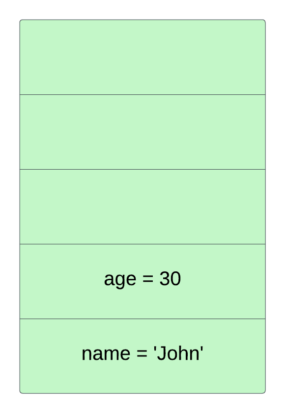
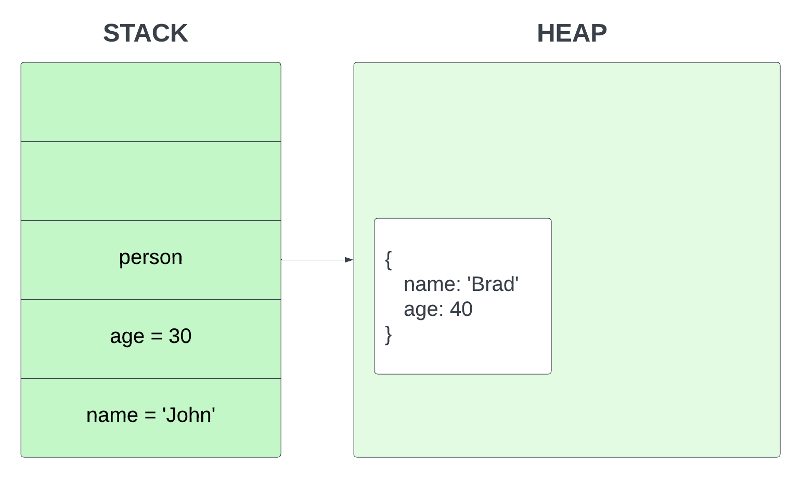
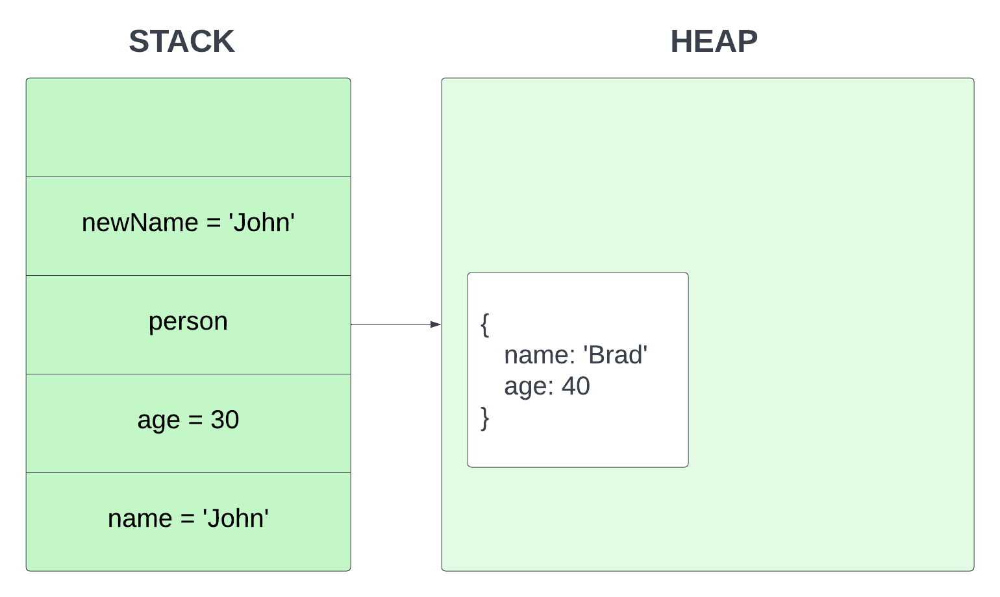
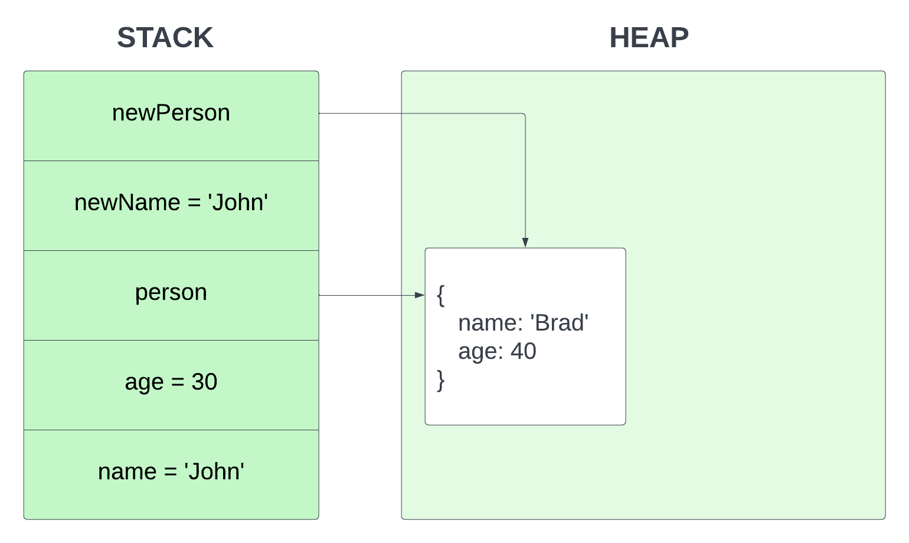
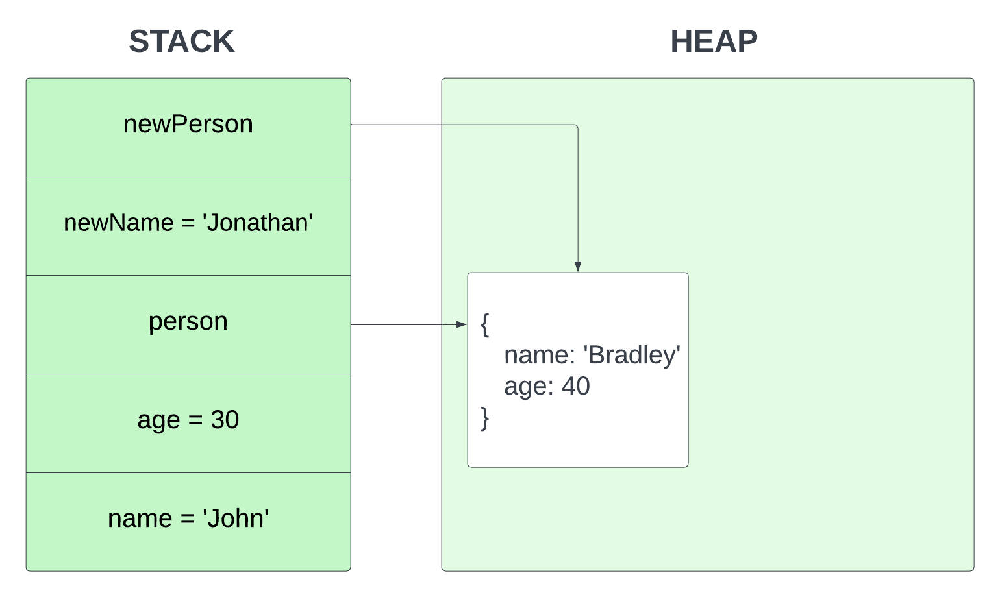

# Stack vs Heap Memory Allocation

Now we're going to look at how `primitive` and `reference` type data is stored in memory. One thing I really want to mention is that if you're a beginner or even intermediate, this may seem a little confusing but that's absolutely fine. In all honestly, I have met senior developers that don't know some of this stuff, so don't let this overwhelm you.

What's really important right now is that you just know the types and know how to create variables. I was iffy on even talking about some of this stuff at this point, but I want to this to be a very thorough course. You can always just take in the basics and come back to these videos later. And I'll do my best to let you know what is really important for the day to day and what is more behind the scenes knowledge.

## Garbage Collection

Before we look at how data is stored in memory, I just want to mention that JavaScript uses something called **garbage collection**. With some low-level languages such as `C` and `C++`, you actually have to manage your own memory. When you create variables, you have to allocate the memory yourself and when you are done, you need to free up that space. It makes programming much more difficult. More modern interpreted languages like `JavaScript` and `Python`, do not have you do this. It is automated with something called garbage collection. That's why you don't technically need to know how this stuff works to start writing JavaScript.

## Memory Allocation

When we create a variable, the JavaScript engine allocates them into two different locations called the `stack` and the `heap`.

Primitive values like strings, numbers, etc are static and immutable data that are fixed. Because of this, the size of the data doesn't change at all, so the space is allocated as a fixed amount and is stored on the stack.

So let's take the following example

```JavaScript
const name = 'John';
const age = 30;
```

To help visualize this, I created a simple image of what the memory stack would look like



Notice that the memory was allocated on the stack for the variable and the value for name and age. This is because they are static primitive values.

Now let's create a **person** `object`

```JavaScript
const person = {
  name: 'Brad',
  age: 40
}
```

Since this is a reference type that is not static and we can add and remove values from it, the object gets stored in the heap



Lets set a new variable called **newName** to reference the primitive **name** variable

```JavaScript
const newName = name;
```

Under the hood, JavaScript copies the primitive value of **'John'** and assigns it to **newName**



Now, let's change the value of the **newName** to **Jonathan**

```JavaScript
newName = 'Jonathan'
```


The **name** value stays the same and only the **newName** is changed. That's because it was passed by the value.

Now lets create a new variable called **newPerson** and set it to **person**

```JavaScript
const newPerson = person;
```

Now the **newPerson** variable references the same value on the heap.



If I were to update **newPerson** object's name value

```JavaScript
newPerson.name = 'Bradley'
```

It would change the reference in the heap as well and now both **person** and **newPerson** will have the name Bradley. This is because it is passed by reference.



So at some point, this knowledge will come in handy when you get into more advanced programming. It's not really beginner stuff, but I do think learning it now gives you a leg up.
