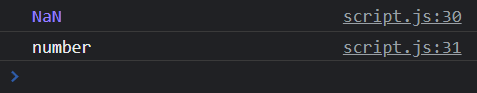

# Type Conversion

In programming, **type conversion** or **type casting** is the process of explicitly converting a value from one type to another. For instance, you may have a string value of **'5'** and you want to convert it to a number value of **5** so that you can do some arithmetic operations on it.

**Type Coercion**, can also be explicit, but also refers to the automatic or implicit conversion of values from one data type to another. We will talk about this in another video.

## Converting Types

There are a few different ways that we can covert types.

We have a variable with the string of '100'

```JavaScript
 let amount = '100';
```

#### parseInt()

We can convert it to a number type with the `parseInt()` function

```JavaScript
  amount = parseInt(amount);
```

#### toString()

If we want to convert it back to a string, we can use the `toString()` method

```JavaScript
amount = amount.toString();
```

A **method** is just a function that belongs to an object.

This brings up a question though. The `amount` variable is a primitive number. How come it has a method of `toString()`?

The answer is that JavaScript will actually create a temporary wrapper object to run `toString()` on

#### Number()

Another way to convert a string to a number is by wrapping it in the `Number()` method

```JavaScript
amount = Number(amount);
```

#### String()

We can convert something to a string using the `String()` method

```JavaScript
amount = String(amount);
```

## Decimals

If you want to convert a string to a decimal, you don't want to use `parseInt()` because an "integer" is either a negative or positive whole number.

Use `parseFloat()` to convert to a decimal

```JavaScript
let amount2 = 5.5;
amount2 = parseFloat(amount2);
```

## Boolean Values

Strings and numbers are not all that we can convert. We can use Number() with booleans

The following would give us a number of 1. If false, it would give us 0.

```JavaScript
let x = true;
x = Number(x);
```

We also have a Boolean() method to turn a number into a boolean. Later I will talk about "truthy and falsey" values.

```JavaScript
x = Boolean(x);
```

The following will give us the string **true**

```JavaScript
x = String(x);
```

## NaN

You saw above that we could run the string of '5' through `Number()` and get the number 5. Well what happens if the string is something like 'hello'?

```JavaScript
let str = 'Hello';
let num = Number(str)
```



We actually get a special "number" called `NaN`, which stands for **Not a Number**... Yeah, that's JavaScript for you. A number that is "not a number". There are some really strange and quirky aspects of JavaScript. The good news is that most of it doesn't get in your way in practical development. It's just when we start to dig down deeper.

`NaN` is a property of the global object and is a non-writable property. There are 5 different types of operations that return NaN:

- Number cannot be parsed (e.g. parseInt("blabla") or Number(undefined))
- Math operation where the result is not a real number (e.g. Math.sqrt(-1))
- Operand of an argument is NaN (e.g. 7 \*\* NaN)
- Indeterminate form (e.g. 0 \* Infinity, or undefined + undefined)
- Any operation that involves a string and is not an addition operation (e.g. "foo" / 3)
