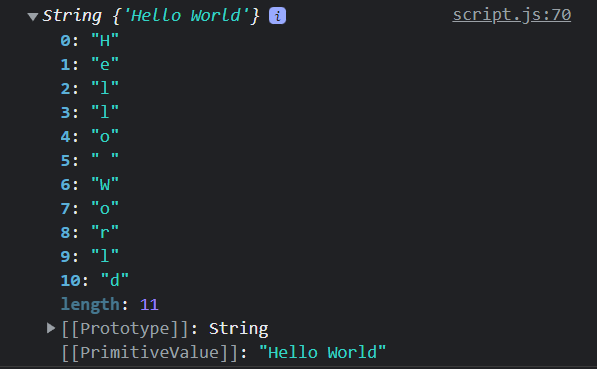

# Working with Strings

Alright, so now we're going to work with strings. I'm going to show you how to concatenate strings, use something called **template literals** as well as look at some methods and properties that we can use on string objects.

### Concatenation

So we briefly looked at concatenating strings, but let's take a deeper look.

The **+** operator is used to concatenate. Let's take two strings and put them together.

```JavaScript
'Hello' + 'World';
```

Pretty simple right? We usually use concatenation to work variables into a string like so

```JavaScript
const name = 'John';
const age = 30;

'Hello, my name is ' + name + ' and I am ' + age + ' years old';
```

I learned PHP before JavaScript and in PHP, we use the period(.) character in the same way, so I picked up on this pretty quickly.

### Template Literals

So in 2015, JavaScript had a major update called `ES2015`, also known as `ES6`. In that update, template literals or "template strings" we introduced. These make is much easier and cleaner to include variables in a string.

```JavaScript
const name = 'John';
const age = 30;

`Hello, my name is ${name} and I am ${age} years old`;
```

So as you can see, instead of using single or double quotes around the string, we use backticks(`).

Then, if we want to use a variable or an expression, we simple surround it in curly braces and prefix it with a dollar sign like this... `${myVariable}`. This makes it much easier because we can just put the variables right into the string and not worry about ending and beginning it again with a + sign. You can also go on to multiple lines. You can not do that with regular concatenation.

### String Properties & Methods

Strings are **primitive** in JavaScript. We have already established that. Primitives do not have properties (attributes) and methods (functions), however if we try and use a method like `.toUpperCase()` on a string, it will work. This is because the JavaScript engine will actually promote them to full blown `string objects`. Same goes for numbers, or at least variables that store numbers.

We can actually create a string object ourselves by using the `new` keyword and then the `String constructor`

```JavaScript
const s = new String('Hello World');
```

This is what happens behind the scenes when we use a property or method on a string. If you check the **typeof** s, you will see `object`.

```JavaScript
console.log(s);
```



If you log the actual value of `s`, you will see an object and each character with a key/value pair. The first key or "index" is always **0**. We can actually get a specific character by its index.

```JavaScript
console.log(s[3]); // prints "l"
```

We get the letter "l" because it is the letter at index 3.

Along with the key/value pairs, we get the primitive type and you'll also see something called a `prototype`.

If you un-collapse this, you will find all of the properties and methods available on the string object. We will get much more into prototypes later when we talk about object oriented programming, etc, but I wanted to show you that this is available in case you want to experiment with it.

You can also access the prototype directly with

```JavaScript
console.log(s.__proto__);
```

Alright, so now that we know how primitive values seem to have properties and methods, let's look at some of them.

There is really only one property that we're going to look at and that is **length**. The rest are methods. Methods are functions, so they always end with parentheses ()

#### length

Length is pretty common for multiple data types. On an array, it will tell us the number of elements in it. If we use it on a number or string object, it will give us the number of characters

```JavaScript
const greeting = 'Hello World';
greeting.length; // 11
```

#### Changing case

In some cases, you may want to change your case to upper or lower case. There are methods we can use for that

```JavaScript
greeting.toUpperCase();
greeting.toLowerCase();
```

#### charAt()

Returns the character at the specified index. All characters in a string have an index that starts from 0. In fact, when we logged the "string object", we saw the key/value pairs. This method will tell you the character or value at the specified index

```JavaScript
greeting.charAt(0); // H
```

#### indexOf()

indexOf() will do the reverse of charAt(). Instead of passing the index, we pass the value and it will give us the index of the first occurrence of the character(s)

```JavaScript
greeting.indexOf('o'); // 4
```

#### substring()

Search a string for a specified value. Pass in the start index and the length. Let's say we want to pull out a substring of 'Hell' from 'Hello World', we would start at character 0 and go 4 in length

```JavaScript
greeting.substring(0, 4); // Hell
```

#### slice()

Extracts a part of a string and returns a new string. It is very similar to substring, but there are some differences, for instance, you can use negative numbers with slice.

```JavaScript
greeting.slice(0, 4); // Hell
//  We can also use negative numbers
greeting.slice(-11, -7) // Hell
```

#### trim()

Trim the whitespace of a string

```JavaScript
x = '       Hello World!        ';
x = x.trim(); // Hello World!
```

#### replace()

Replace all instances of a string

```JavaScript
  const url = 'https://traversymedia.com';
  url.replace('traversymedia', 'google'); // https://google.com
```

### includes()

Returns true if a searched string is found

```JavaScript
url.includes('media'); // true
```

#### valueOf()

Returns the primitive value of a variable

```JavaScript
url.valueOf(); // https://traversymedia.com
```

#### split()

Splits a string into an array and takes in a separator parameter. If we add a space, it will put every word in it's own array item.

```JavaScript
greeting.split(' '); // ['Hello', 'World']
```
