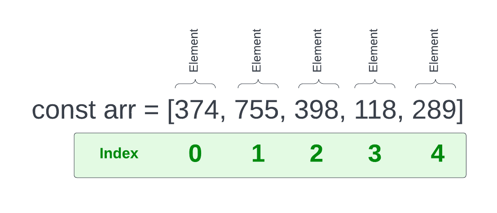

# Array Basics

`Arrays` are a special type of `object` in JavaScript. Arrays are also what we call a `data structure`, which is just that, a way of structuring data. Lets look at a basic Array



We create a variable and set it to some brackets with some values inside. The values could be of any type. In this case, we have an array of numbers.

The values in an array are called `elements`. Each element has an `index`. The index is the position of the element in the array. The first element in an array has an index of 0. The second element has an index of 1, and so on. In just about every language, arrays are zero-based.

Let's create this same array in our code

```javascript
const arr = [374, 755, 398, 118, 289];
```

If we log the array in the console, we'll see that like other types of objects, it has a prototype property. These are all kinds of properties and methods that can be used with arrays. We'll get more into those in a little bit.

```javascript
console.log(arr);
```

#### Array Constructor

There is a second way to create an array that is less common. The one that we have already used is called an `array literal`. The second is by using the `Array` constructor with the `new` keyword

```js
const arr2 = new Array(1, 2, 3, 4, 5);
```

You can use either one to create an array. They both create an array object.

#### Getting values by index

So to get one of these values, we can use the index of the element we want to get. To get the first one

```javascript
arr[0];
```

If we wanted to use an array value in an expression, we could

```javascript
arr[0] + arr[3]; //492
```

Arrays can have any type of data within it. In this case, we have an array of numbers, but we could create an array of strings

```javascript
const fruit = ['apples', 'oranges', 'pears'];
```

We can even mix types of data within an array and even have an array within an array

```javascript
const mixed = [1, 'string', true, null, undefined, [1, 2, 3]];
```

#### Array length

We can get the length of an array using the `.length` property, which is very useful

```javascript
console.log(arr.length); // 5
```

#### Mutating arrays

Arrays are mutable, meaning we can add, change and remove elements. There are many methods that we can use and I'll get into those in a little bit, but lets say we want to add a new element to the end without using any kind of method.

We know that the `length` property gives us the total count of elements and since the array is 0-based, we can simply add the length as the index of the new element

```JavaScript
fruit[fruit.length] = 'Peaches'; // ['apples', 'oranges', 'pears', 'peaches']
```

````

In the code above, `fruit.length` was `3` so we set the value of `fruit[3]`, which was the next index.

If we want to target a specific index and change the value, we can do that easily

```javascript
fruit[1] = 'mangos';
````

We can also set the array length to a new value, which will shorten the array

```JavaScript
fruit.length = 2;
```

Now the array would look like this

```javascript
['apples', 'oranges'];
```
