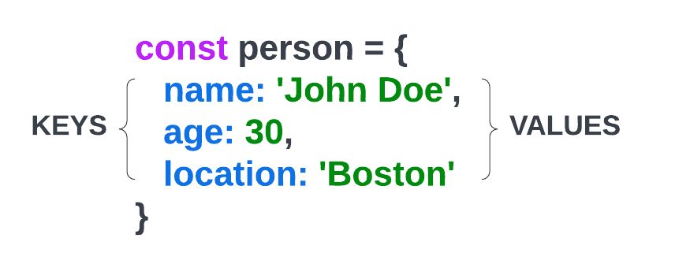

# Object Literals

I want to talk about a very common JavaScript data structure that holds key/value pairs called an `object literal`. We can also create objects using a `constructor`, but I will get into that later on. The main difference between using a constructor and an object literal is that the object literal is a `singleton`, meaning that it is a **single instance** of the object. With a constructor, we can create multiple instances of the object. Most of the time, we will use the object literal syntax.



The image above shows us the syntax to create a new object. Essentially, all an object is, is a set of `properties` with `key/value` pairs. The `key` is often called the `property name`. The values go by the same types and principles as anything you would set in a regular variable (string, number, boolean, etc)

```js
const person = {
  name: 'John',
  age: 30,
  location: 'Boston',
  hobbies: ['movies', 'music'],
  isAdmin: false,
};
```

We can also nest objects, but I'm going to go over that in next video.

### Accessing property values

To access a value, we can use both dot notation and bracket notation.

```js
// Dot notation
person.name; // John

// Bracket notation
person['name']; // John
```

We will typically use dot notation and use brackets with arrays. Although, technically arrays are just objects with a numeric index.

To access the first hobby in the array:

```js
person.hobbies[0]; // movies
```

### Adding & updating properties

I just manually added and changed some of the properties directly in the object above, but to programmatically add or change properties, we could do this:

```js
person.email = 'john@gmail.com'; // Add a new property
person.isAdmin = true; // Update an existing property
```

### Removing properties

To remove a property, we can use the `delete` keyword.

```js
delete person.isAdmin;
```

### Adding functions to objects

Not only can we store primitives, arrays and other objects, we can also store functions as an object's property.

```js
person.greet = function () {
  console.log('Hello, my name is ' + this.name);
};
```

Notice I used the keyword `this` to access the `name` property. This is because `this` refers to the object that the function is being called on. This is where `scope` comes into play. If we are in the `global scope`, then the `this` keyword refers to the `global object` or the `window` in the browser. We'll get more into scope in the next section.

We can call the greet function like this:

```js
person.greet(); // Hello, my name is John
```

### Using multiple words in property names

If you want to use multiple words as a property name or key, you can use quotes or backticks to wrap the property name.

```js
const person2 = {
  'first name': 'Brad',
  'last name': 'Traversy',
};
```

We have to use bracket notation when using property names with multiple words.

```js
person2['first name']; // Brad
```
