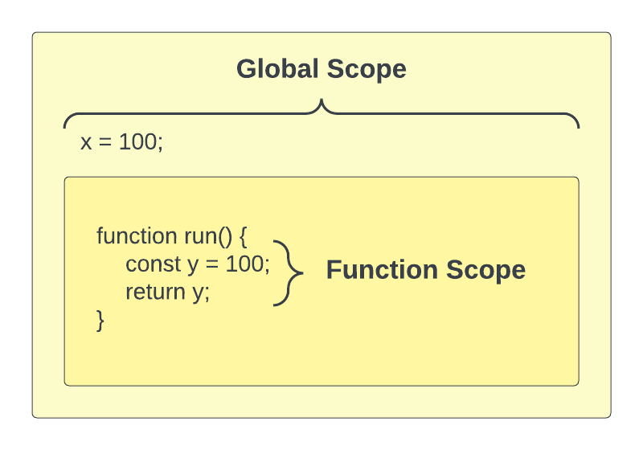

# Global & Function Scope

**Scope** is an important concept, not only in JavaScript, but in many other programming languages. Scope is the current area or context of a specific piece of code. There are certain rules for what is accessible in specific scopes.



### Global Scope

In JavaScript, when we write code in the `global scope` it is available everywhere, including functions. If we are NOT inside of a function or any kind of block, such as an if statement or a loop, then we are in the `global scope`.

#### The `window` object

The browser creates a global object called `window`. This object has a ton of methods and properties on it that are available to us that we'll be looking at later on in the course.

The `alert` method belongs to the window object.

```JavaScript
window.alert('Hello World');
```

Since the window object is the most top-level object in the browser environment, we don't need to use **window**

```JavaScript
alert('Hello World');
```

There is an `innerWidth` property on the window object. We could use that anywhere as well

```JavaScript
console.log(window.innerWidth);
```

We can use it in a function as well because it is global

```JavaScript
function run() {
  console.log(window.innerWidth);
}
```

#### Creating globally scoped variables

If I simply create a variable at the top of a JavaScript file, this is a global variable in the global scope and I can access it anywhere.

```js
const x = 100;
console.log(x); // 100
```

If we try to access x in the `run()` function, we can because it's global.

```JavaScript
function run() {
  console.log(x); // 100
}
```

### Function Scope

Function scope is the scope that is available to all code inside of a function. Any variables we define here will be available only inside of the function.

```js
function add() {
  const y = 50;
}

console.log(y); // ReferenceError: y is not defined
```

Since `x` is global, I could use that in the `add()` function

```js
function add() {
  const y = 50;
  console.log(x + y); // 150
}
```

If I create a variable called `x` in the function, it will overwrite the global variable and I can no longer access it. This is called **variable shadowing**.

```js
function add() {
  const x = 1;
  const y = 50;
  console.log(x + y); // 51
}
```

### Local Scope

Whatever scope we are currently working in or talking about is called the `local scope`.
