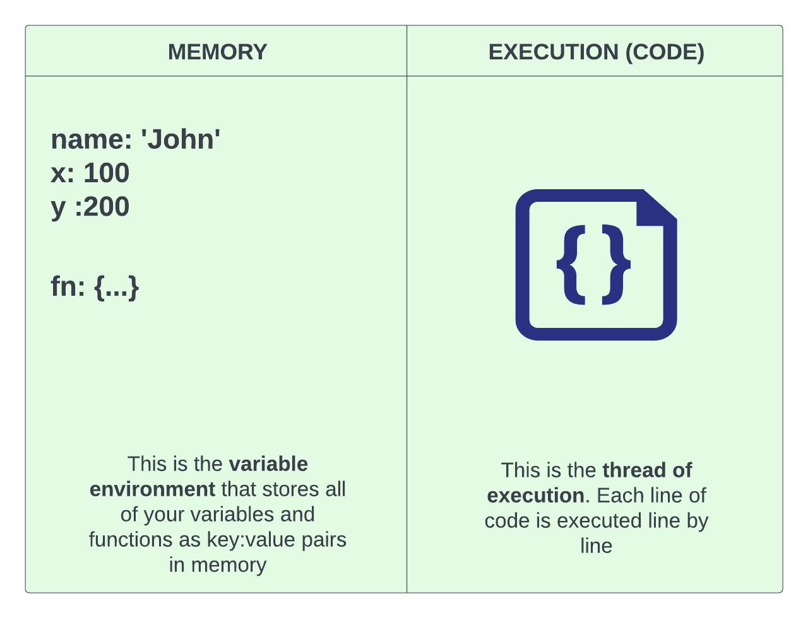

# Execution context

Inside the browser is a JavaScript engine that handles executing our JavaScript. That engine creates a special environment to handle the transformation and execution of code. This environment is called the `execution context`, and it contains the currently running code and everything that aids in its execution.

When we load a JavaScript file in the browser, the first thing that the engine does is create a new execution context. This is called the `global execution context`. It basically includes all of the code that is in the `global scope`. We talked about scope earlier.

## Visualizing the execution context

To give you a better idea of what the execution context looks like, you can picture it as a box with 2 sides. One side is the `variable environment` which is a memory area for your variables and functions in key-value pairs.

Then on the other side,you have your actual lines of code being run. This is the `thread of execution`. The code is executed one line at a time on a **single thread**, which you can think of as like a **process**. JavaScript is a single-threaded, synchronous language.



## Types of Execution Contexts

So we have a couple different types of execution contexts.

**Global Execution Context**
The global execution context is the default or base execution context. This is created when you run a JavaScript file in a browser. It is NOT within a function. When the global execution context is created, it performs two things. It creates the `global object` which is the `window` object in a browser. In Node.js, it's just called the `global object`. It also sets the value of the `this` keyword equal to the global object.

**Function Execution Context**
When a function is invoked, a new execution context is created for that function. Each function has its own execution context. So a new box with the 2 sides is created for the code within the function.

**Eval Execution Context**
eval() is a function property of the global object. Most JavaScript developers don't use eval, so I'm not even going to get into it here.

So just remember that we have a `global` execution context and when a function is invoked, it has it's own `function` execution context.

### Execution Context Phases

When you run a piece of JavaScript code, you create a new execution context and its created in two phases.

- The first being the **memory creation phase** or sometimes just called the **creation phase**. This is where JavaScript allocates the memory for all of the variables and functions. This happens before any code is executed. Think of it as a first pass where the JavaScript engine just goes over all the code and puts the variables and functions into memory.

- The second is the **execution phase** where the code is executed line by line. This happens after the memory creation phase.

One thing to note is that in the memory creation phase, your variables are all put into memory as `undefined`. The actual values of the variables are set during the execution phase. However, functions are directly stored in memory with all of the code inside of them.

### Execution Context In Action

Let's take the following code and see exactly what happens when it runs:

```JavaScript
1  var x = 100
2  var y = 50
3  function getSum(n1, n2) {
4    var sum = n1 + n2
5    return sum
6  }
7  var sum1 = getSum(x, y)
8  var sum2 = getSum(10, 5)
```

#### 1. Global execution context is created

- Global object is created and assigned to `this`

#### 2. Memory creation phase (global execution context)

- **Line 1:** `x` variable is allocated memory and stores `undefined`
- **Line 2:** `y` variable is allocated memory and stores `undefined`
- **Line 3:** `getSum()` function is allocated memory and stores all the code in the function
- **Line 7:** `sum1` variable is allocated memory and stores `undefined`
- **Line 8:** `sum2` variable is allocated memory and stores `undefined`

#### 3. Execution phase (global execution context)

- **Line 1:** places the `100` into the `x` variable
- **Line 2:** places the `50` into the `y` variable
- **Line 3:** skips the function because there is nothing to execute. It is a declaration
- **Line 7:** Invokes the `getSum()` function and creates a **function execution context** with a new **variable environment** and **execution thread**. It will also run the **memory phase** and the **execution phase**.

#### 4. Memory creation phase (function execution context)

- **Line 3:** parameters `n1` & `n2` variable is allocated memory and stores `undefined`
- **Line 4:** `sum` variable is allocated memory and stores `undefined`

#### 5. Execution phase (function execution context)

- **Line 3**: `n1` & `n2` are assigned `100` and `50`
- **Line 4**: The calculation is done and the result (150) is put into `sum` variable
- **Line 5**: return tells the **function execution context** to return to the **global execution context** with this value of `sum` (150)
  **Line 7** - The returned sum value is put into the `sum1` variable in the **global execution context**. The execution context of that function is then **deleted**.
  **Line 8** - We repeat the same process and create a new **function execution context**, just with different parameters being passed in.
