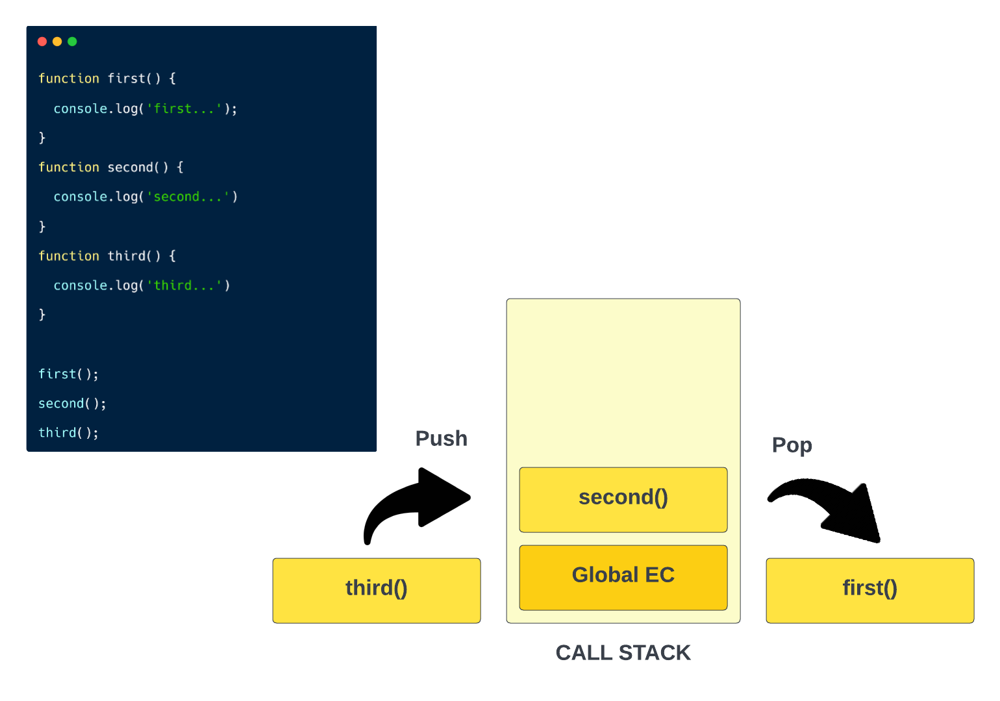
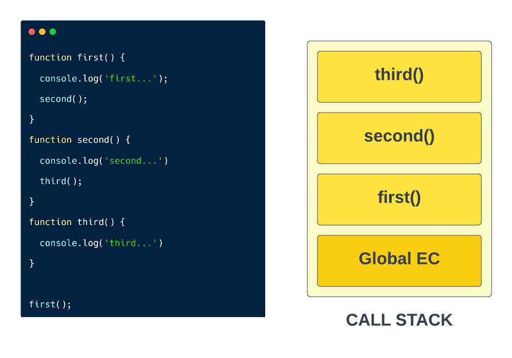

# The Call Stack

So we talked about the `execution context` in the last video and stepped through some code to see exactly what was happening under the hood. We had our global execution context and we had our function execution context. Well every function that was invoked was added to something we call the `call stack`. It's also referred to as the `execution stack` and many other terms. This keeps track of the functions that are currently being executed. You think of it as an execution context manager.

## What is a stack?

In computer science, a `stack` is a data structure. Later in the course, we'll get deeper into stacks. It's a **LIFO (last in, first out)** data structure. What this means is the last thing to be put on top of the stack is the first to come off.

To give you a better picture of this, lets look at some basic code. And Ill actually show you this in the browser as well because you can see the call stack in the sources tab.

Here we have three functions that are all being run in the global scope. When I say global scope I just mean not in a function. So this is how the call stack would work in this case.

First of all, the global execution context is always at the very bottom of the call stack. Then the function named first will get put on to the stack because that is the first function run in our code. The technical terminology is `push` when something is placed on the stack and `pop` when something is taken off. So first() will be pushed on and executed and popped off. Next, second() will be pushed on and executed, then popped off and finally, third(). Since they're all in the global scope, they don't ever get stacked on top of each other. It's just one after the other.

Now let's look at a different example.

Here, the only function being invoked in the global scope is first(). then in the first() function, the second() is being invoked, now were still in the process of executing first(), so that stays on the stack and second() is pushed on top of it. Then in second(), were executing third(), so first() and second() are still on the stack and third() gets added as well. Once the final console log is done, third() is done and taken off in `last in first out` fashion, then second() is done that gets popped off then first(). Then it's done and the `global execution context` is deleted.
