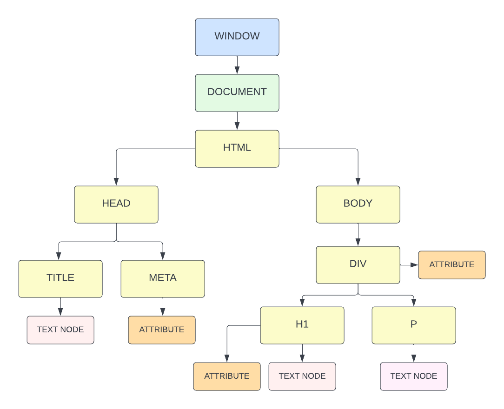

# Intro To The DOM

Alright, so now we get to get to the fun stuff, working in the actual browser body and not just in the console. I think one of the big mistakes people make is they jump into the browser too quickly without understanding the stuff that we have talked about so far. Now that you understand control flow, functions, array methods, etc, you will be able to do more within the browser.

## The DOM

The DOM stands for **Document Object Model**, It is essentially a programming interface for web/HTML documents. We already know that we display the content on web pages using HTML tags with text and we style it using CSS. The DOM is the structure of the web page that we can interact with using JavaScript. It generally includes all of the HTML tags, attributes and the text between the tags called "text nodes". The DOM is usually represented as a tree structure.

Let's look at this very simple page structure:


The DOM representation of this would look something like this:



I'll talk about the `window` and `document` objects in a minute, but under that you'll see the structure of this document in a tree structure.

We have the `html` element, which holds the `head` and `body` elements. The `head` element holds the title element, which has a text node inside of it. In this case that would be the text, 'Website'. The `meta` element includes an attribute of `charset` which is set to `utf-8`. So any attributes are going to be accessible in the DOM as well. The `body` element holds the `h1` element, which has a text node inside of it with the text, 'Hello World'. It also has an `id` attribute. Then we have the `p` element with a text node inside of it.

So this is how your HTML document full of tags, attributes and text nodes looks in the DOM.

## The Window Object

A few sections back, we talked about the global `window` object. The `window` object is the top level object in the browser. It is the root of the browser's object hierarchy. It has properties and methods that are available to all of the JavaScript code in the browser. To see the window object's API (methods and properties), you can type `window` in the console or in your code

```JavaScript
console.log(window);
```

# The Document Object

On that `window` object, we have a property/object called `document`. This is an object that represents the HTML document that we are currently viewing. It has all types of properties and methods that we can use to interact with the HTML document.

```JavaScript
console.log(window.document);
```

Since `window` is the top-level object in the browser, we do not need to prefix it with **window**

```JavaScript
console.log(document);
```

Sometimes console.log() will show the properties and methods, but sometimes it will show the element/tag itself. To see all the methods and properties, you can use `console.dir`

```JavaScript
console.dir(document);
```

## Document Properties/Elements

We can access DOM elements directly, such as the `body`

```JavaScript
console.log(document.body);
```

We can also access elements such as links and images. Let's add a link to the HTML

```HTML
<a href="https://traversymedia.com">Traversy Media</a>
```

We can get all of the links with

```JavaScript
console.log(document.links);
```

This returns something called an `HTMLCollection`, which is similar to an array. We can access by index

```JavaScript
console.log(document.links[0]);
```

## Document methods

In addition to properties, the document object has a ton of methods. `document.write()` is a method that will write to the browser body. This is not used very much because you can't really target where you want to output, but it is available

```JavaScript
document.write('Hello From JS');
```

## Document Selection Methods

Getting elements using direct properties is not usually the way you want to do this. There are special methods available that allow us to directly select elements easily. I will be going over all of these in depth soon, but just to give you an example, let's look at `document.getElementById()`, which does exactly that. It allows us to basically grab an element from the HTML document by it's id. Then we could do whatever we want to that specific element including changing the style, removing it, adding an event listener to it and so on. The term `DOM manipulation` just refers to changing the DOM using JavaScript, which again can me adding, removing, changing elements, etc. A lot of the time we change the CSS through JavaScript to make something hide or show based on some user interaction.

Just to give you a very simple example of selecting something from the DOM, let's open an html page and create a new div element with the ID of `main` and just add some text to it.

```html
<div id="main">
  <h1>The DOM</h1>

  <a href="https://traversymedia.com">Traversy Media</a>
</div>
```

Now in our JavaScript file, we can use the `document.getElementById()` method to grab the element with the ID of `main`.

```js
console.log(document.getElementById('main'));
```

Now let's say we want to add some text into the div element. We can easily do that using the `innerHTML` property.

```js
document.getElementById('main').innerHTML = '<h1>Hello World</h1>';
```

This will replace everything in the main element. There are other methods we will get into soon that let us just append or add elements.

So you see, The DOM gives us a lot of power to interact with the HTML document. The code we just wrote is written in JavaScript, but uses the DOM and it's API to access the document and its elements. Even when you start using a front-end framework like React, this is the stuff that it is doing under the hood.

The DOM was created to be independent of any particular language. Yes, JavaScript is definitely the most common language to do this stuff with, but implementations of the DOM can be built for any language, as this Python example demonstrates:

```python
# Python DOM example
import xml.dom.minidom as m
doc = m.parse(r"C:\Projects\Py\chap1.xml")
doc.nodeName # DOM property of document object
p_list = doc.getElementsByTagName("para")
```

## DOM Libraries

I've been doing this for about 15 years now and I know people still complain about JavaScript, but I think very few of them, worked with JavaScript ten+ years ago. Before the big ES6 update, JavaScript was not easy to work with, including accessing and manipulating the DOM. So we had libraries like **jQuery** that were built to make it easier to work with the DOM.

A lot of people ask me if they should learn jQuery and my answer to that now is usually no. If you're genuinely interested in learning it, that's fine. Just make sure you learn the fundamentals of vanilla JavaScript first. You may want to learn jQuery to deal with legacy code. There is a chance you'll run into it in the wild. But do you need to learn it? In my opinion, no you don't.

Alright, so in the next video, I want to examine some of the properties on the browser's `document` object itself.
