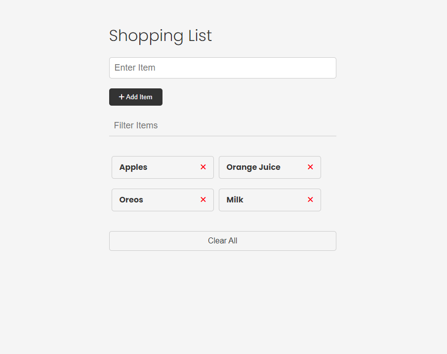
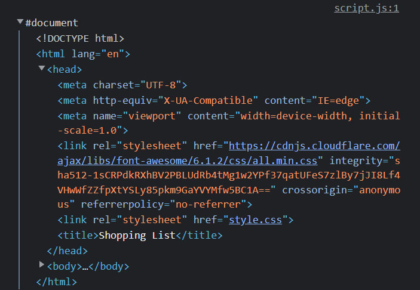
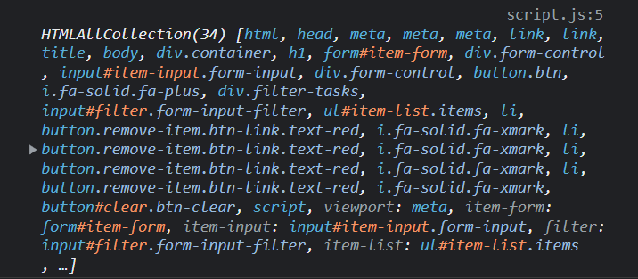
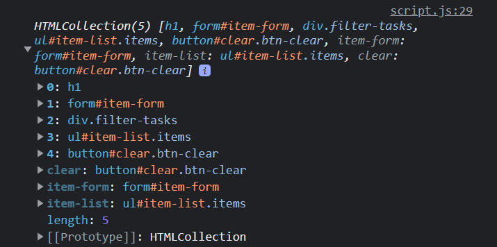
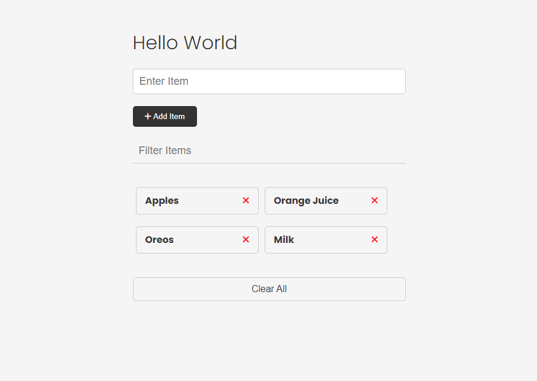

# Examining the Document Object

Alright, so we know that the DOM is a tree of objects of elements, nodes and attributes. We also know that the `document` object is the root of the DOM tree. It offers extremely helpful methods for us to use to manipulate the DOM including methods to select elements, create elements, and so on. There's also a ton of properties that we can use to get information about the document and that's what I want to look at in this video.

### Shopping List UI



So what you're looking at right now is the UI or user interface for a simple shopping list application. We will be building this project out, but right now, it's only the HTML and CSS, so it's not actually working because there's no JavaScript. There is a JavaScript file linked, but it's empty. That's what we'll be working in to explore the DOM.

You can download the code resources directly from this section, or from the main sandbox GitHub repository.

Let's quickly just look at the structure of this HTML page, so we know what we're working with.

So we have a container that wraps around everything, a heading, then we have a form that has one single text input and a submit button. Under that, we have a filter input to filter the items. Then we have a list of items with an x icon to remove those items. As I mentioned, the functionality of this will not work because we have no JavaScript. Finally, we have a clear all button that will do just that.

So, it's a pretty simple UI, but it's a good starting point for us to explore the DOM.

### Browser Dev Tools

The browser dev tools will be used extensively throughout this course. We've been using the console quite a bit, but I want to check out the `Elements` tab real quick. This is where you can see all of your elements/tags, attributes, text, etc. In reality, you should know some HTML and CSS and you should have at least a little experience with this tab.

We can see the CSS styling here as well. In many cases, we'll be changing styles and adding and removing classes through JavaScript and we'll be using the dev tools to see what's happening.

### The Document Object

So if we type into the console `window`, we see everything that is available to use in the global object and `document` is one of them. You can see that there's a ton of properties and methods available to us. Anything you see here can be used in your JavaScript code.

Let's start off by just logging the document.

```js
console.log(document);
```



It gives us just that, the entire document including the doctype, html tag and head and body tags with everything in between them.

### `document.all`

```js
console.log(document.all);
```



`document.all` gives us everything in the DOM in an array-like object called a `HTMLCollection`. It's not an array, but it is structured like one. We can't use methods like `forEach()` and `map()` on it, but we can use bracket notation to access the items. We can also use the `length` property to get the number of items in the collection. There's also a method called `item()` that we can use to get a specific item in the collection.

```js
console.log(document.all.length);
console.log(document.all[2];
console.log(document.item(2));
```

`document.all()` is not a very useful method and it's actually deprecated, so we shouldn't use it. It's better to use methods like `document.getElementById()`. I did want to show you that it exists and give you an example of an HTMLCollection.

### `document.documentElement`

```js
console.log(document.documentElement);
```

This will get you the HTML element and everything in it including both the head and body tags.

### `document.head` & `document.body`

```js
console.log(document.head);
console.log(document.body);
```

These two properties give us the head and body elements. We can get the children of those elements using the `children` property.

```js
console.log(document.head.children);
console.log(document.body.children);
```

These will give us an HTMLCollection of the direct children of the head and body elements. So in the case of the body, we only get the container div and the script tag because those are the only direct children of the body element.


If I wanted to get the children of the container div, I would have to do something like this.

```js
console.log(document.body.children[0].children);
```



So now I have a collection of all of the children of the container div. This is a little bit cumbersome and there are better ways to select elements, but let's say I wanted to change the text of the heading. I could do something like this.

```js
document.body.children[0].children[0].textContent = 'Hello World';
```



### Other Page Properties

Here are some other properties on the `document` object that we can access and manipulate.

```js
document.doctype;
document.domain;
document.URL;
document.characterSet;
document.contentType;
```

### `document.forms`

`document.forms`. This will give us an HTMLCollection of all of the forms on the page.

```js
console.log(document.forms);
```

We can get specific forms in the collection by index or by name.

```js
console.log(document.forms[0]);
console.log(document.forms['item-form']);
```

We can get specific attributes as well

```js
console.log(document.forms[0].id);
console.log(document.forms[0].method);
console.log(document.forms[0].action);
```

We aren't only limited to reading the attributes. We can also change them.

```js
document.forms[0].id = 'new-id';
```

I could add a value to the input like this:

```js
document.forms[0].item.value = 'Hello World';
```

`item` being the `name` attribute of the input.

### `document.links`

To get an HTMLCollection of links, we can use `document.links`.

```js
console.log(document.links);
```

We don't have any links in this specific project, so let's add one just to test it out.

```html
<a href="#" class="my-link" id="link">My Link</a>
```

Now we can see that we have a link in the collection.

We can get specific attributes as well.

```js
console.log(document.links[0].id);
console.log(document.links[0].className);
console.log(document.links[0].classList);
console.log(document.links[0].href);
```

### `document.images`

We can also get an HTMLCollection of images with `document.images`.

```js
output = document.images;
output = document.images[0];
output = document.images[0].src;
```

In the code above, we accessed the attributes directly, but we can also use the `getAttribute()` method.

```js
output = document.images[0].getAttribute('src');
```

This will do the same thing as accessing the `src` attribute directly.

### `document.scripts`

If you want to get an HTMLCollection of scripts, you can use `document.scripts`.

```js
console.log(document.scripts);
```

So as you can see, everything in our HTML document is available to us in the DOM using the document object that the browser creates for us.

This is just the tip of the iceberg. There are so many more properties and methods available. We'll be using them throughout the course.
