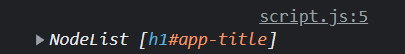
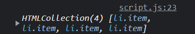

# DOM Selectors - Multiple Elements

So we looked at `getElementById` and `querySelector`, which will select on element from the DOM so that we can do whatever we want with it. But what if we want to select multiple elements, such as all of the list items in our shopping list? We have a few methods that we can use for this.

## `querySelectorAll()`

So I'm going to start off with the one that you'll use the most, which is `document.querySelectorAll()`. This method takes a string as an argument and returns a NodeList of all the elements that match the selector. If no elements are found, it returns an empty NodeList.

#### NodeList vs HTMLCollection

So what is a NodeList? Well, it's very similar to an HTMLCollection, which we have already looked at. It's a list of elements that is formatted like an array. The main difference is that a NodeList is not a live collection. This means that if we add or remove elements from the DOM, the NodeList will not update.

Another difference is that we can use methods like `forEach()` on a NodeList, but not on an HTMLCollection. This really comes in handy.

So let's select all of the list items in our shopping list.

```js
console.log(document.querySelectorAll('li'));
```

We can pass in absolutely any CSS selector to this method. It could be a tag, id, class, etc. That part works just like `querySelector()`. The difference is instead of getting just one element, it will get all of the elements on the page that match that selector. Even if there is only one item on the page that matches, it will still be returned as a NodeList.

If we select the h1 on the page, let's see what happens.

```js
console.log(document.querySelectorAll('h1'));
```



Instead of the element itself, it gives us a NodeList with that 1 element in it.

Now, let's say that we want to make all of the items in the list the color red. Your first thought, may be to do something like this.

```js
const items = document.querySelectorAll('li');

// This will not work
items.style.color = 'red';
```

This won't work because we can't assign a color to a NodeList.

We can access a specific item using it's index, just like an array. We can also manipulate it.

```js
console.log(items[0]);
items[0].style.color = 'blue';
```

However, if we want to apply something to all of the elements, we need to loop through the NodeList and apply to all.

```js
items.forEach(function (item) {
  item.style.color = 'red';
});
```

We can shorten it up a little bit by using an arrow function.

```js
items.forEach((item) => (item.style.color = 'red'));
```

## `getElementsByClassName()`

The next selector is an older one that you probably won't see very much. As the name implies, it selects elements by their class name. It takes a string as an argument and returns an HTMLCollection of all the elements that match the class name. If no elements are found, it returns an empty HTMLCollection.

The limitations to this method are that it only selects elements by class name and instead of a NodeList, it returns an HTMLCollection, which you can't use methods like `forEach()` on. You would have to first, turn the HTMLCollection into an Array and then loop through it.

Let's look at an example. I put a class of `item` on all of the list items in our shopping list. Let's select them all.

```js
console.log(document.getElementsByClassName('item'));
```



As you can see, it returns an HTMLCollection of all of the list items as opposed to a NodeList.

If we want to turn all of the items blue, we have to first turn the HTMLCollection into an array. Then we can use array methods like `forEach()`.

```js
const items = document.getElementsByClassName('item');

// Covert into an array
const list = Array.from(items);

list.forEach((item) => (item.style.color = 'green'));
```

## `getElementsByTagName()`

This method is basically the same thing as `getElementsByClassName()`, except it selects elements by their tag name. It takes a string as an argument and returns an HTMLCollection of all the elements that match the tag name. If no elements are found, it returns an empty HTMLCollection.

Let's select all of the list items in our shopping list.

```js
console.log(document.getElementsByTagName('li'));
```


We get the same result as `getElementsByClassName('item')`.

There really isn't much else to be said on this method, because you can do the same stuff as `getElementsByClassName()`.

I would say 99.9% of the time, you will be using `querySelectorAll()` to select multiple elements. The only time you would use `getElementsByClassName()` or `getElementsByTagName()` is if you are working with an older codebase that uses those methods.
