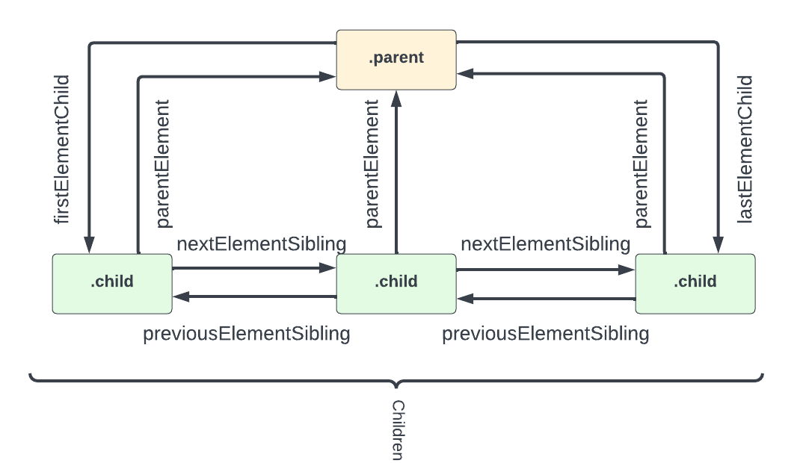

# Traversing The DOM - Elements

Now we know how to select elements from the DOM, but many times, we need to select elements within elements or a sibling of an element, so it is important to know how relationships work so that we can traverse or move up and down the DOM.

There are also different types of `nodes` in the DOM. The type we will deal with the most are `Elements`. Any HTML tag on the page is an element. There are specific properties for working with elements and there are properties that will allow us to work with other types of nodes, such as `Text` and `Comment` nodes. In this video, we will strictly be working with `Elements` or `Element Nodes` and in the next video, we will look at other types of nodes.

## Element Relationships

To really understand how to traverse and manipulate the DOM, you need to understand relationships between elements along with some properties that allow you to select elements based on their relationship to other elements.

For this video, I'm not going to use the shopping list example. Instead, I'm going to use a simple HTML document with a few nested elements. This is so you can better understand what I'm doing.

Let's look at the following HTML

```html
<div class="parent">
  <!-- Children -->
  <div class="child">Child 1</div>
  <div class="child">Child 2</div>
  <div class="child">Child 3</div>
</div>
```

If we are looking strictly at `element nodes`, it's pretty simple. We have a `div` that is the _parent_ of 3 _child_ `divs`. The 3 _child_ `divs` are _siblings_ to each other.

## Selecting Related Elements

We have many properties available to select related elements. This diagram shows the properties and a visual example of how they work.



## Child Elements

### `children`

All of an elements children can be accessed by the `children` property.

```js
const parent = document.querySelector('.parent');

console.log(parent.children);
// HTMLCollection [div.child, div.child, div.child]
```

This gives us an `HTMLCollection` of the children. We can access each individual element by index.

```js
console.log(parent.children[1]);
// <div class="child">Child 2</div>

// Get individual child properties
console.log(parent.children[1].nodeName);
// 'DIV'
console.log(parent.children[1].className);
// 'child'

// Get the HTML & Text inside the element
console.log(parent.children[1].innerHTML);
// 'Child 2'

// Get the HTML & Text of the entire element
console.log(parent.children[1].outerHTML);
// '<div class="child">Child 2</div>'
```

We can loop through an HTMLCollection using a for loop or we can convert it to an array and use a forEach loop.

```js
for (let i = 0; i < parent.children.length; i++) {
  console.log(parent.children[i].innerHTML);
}
```

We can change attributes, styles and the content of the children of an element

```js
// Change the text of the second child
parent.children[1].textContent = 'Child Two';

// Change the color of the third child
parent.children[2].style.color = 'red';
```

### `firstElementChild` and `lastElementChild`

`firstElementChild` and `lastElementChild` are useful for selecting the first or last child of an element.

```js
console.log(parent.firstElementChild);
// <div class="child">Child 1</div>

console.log(parent.lastElementChild);
// <div class="child">Child 3</div>

// Change the text of both first and last child
parent.firstElementChild.innerText = 'Child One';
parent.lastElementChild.innerText = 'Child Three';
```

## Parent Element

### `parentElement`

We can use the `parentElement` property to get the parent element of an element.

```js
const child = document.querySelector('.child');

console.log(child.parentElement);
// <div class="parent">
```

We can edit the parent element

```js
// Give the parent a border and padding
child.parentElement.style.border = '1px solid #ccc';
child.parentElement.style.padding = '10px';
```

## Sibling Elements

### `nextElementSibling` and `previousElementSibling`

These are the main properties for selecting sibling elements.

```js
const secondItem = document.querySelector('.child:nth-child(2)');

secondItem.nextElementSibling.style.color = 'green';
secondItem.previousElementSibling.style.color = 'orange';
```

As you can see, working with related elements is not that difficult because we have access to these useful properties. In the next video, we will look at properties to work with other types of nodes.
