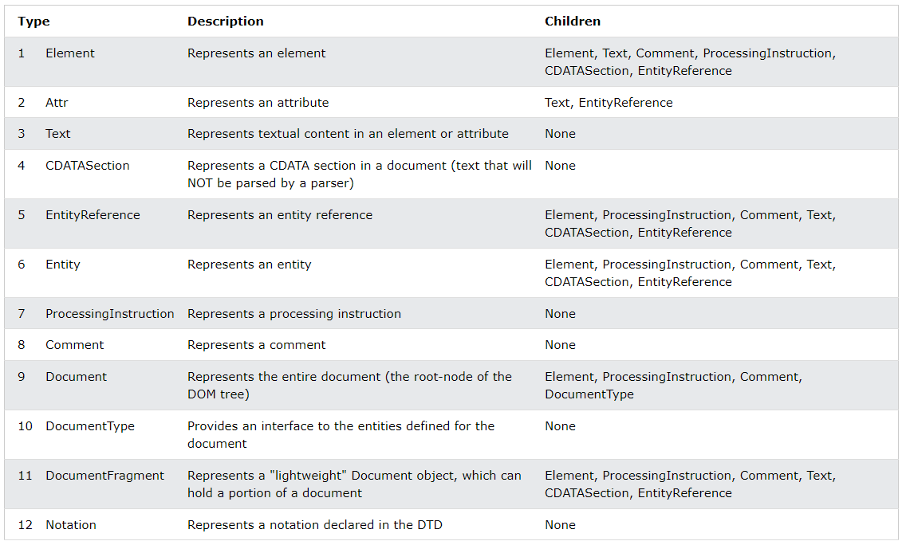
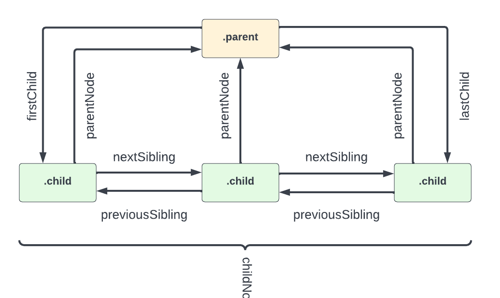
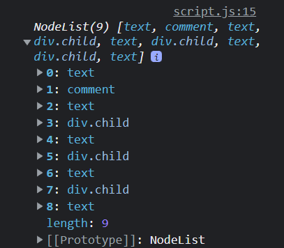

# Traversing The DOM - Nodes

Alright, so we looked at some important properties of the DOM that allow us to work with related elements. However, the DOM has more than just element nodes. In fact, there are 12 different types of nodes.



<small>_Table from W3Schools.com_</small>

We don't really need to focus on most of these, but they're good to know.

## Properties That Work With Nodes

The properties that we looked at in the last video were to work with related elements. However, there are other properties that we can use to access other types of nodes.

I would say for the most part, you will use the properties that we looked at in the last video, but you should know these as well.

We are going to use the same HTML structure as in the last video:

```html
<div class="parent">
  <!-- Children -->
  <div class="child">Child 1</div>
  <div class="child">Child 2</div>
  <div class="child">Child 3</div>
</div>
```



## Child Nodes

### `childNodes`

This method, does exactly what it says, it gets all of the child nodes of an element. This includes `text nodes` and `comment nodes`.

```js
const parent = document.querySelector('.parent');

console.log(parent.childNodes);
```



As you can see, we get a NodeList of 9 items. I want to go over what each of these items are...

- 0: White space is a `text node`. Since the first line of HTML within the parent `div` (the comment) is on the next line, that line break is considered a `text node`. If I were to move the comment on to the same line as the parent `div`, then the `text node` would be removed. I know, it's weird.
- 1: The `comment` node. Comments are considered nodes as well.
- 2: Another `text node`. This is the line break between the comment and the first child `div`.
- 3: The first child `div`.
- 4: Another `text node`. This is the line break between the first child `div` and the second child `div`.
- 5: The second child `div`.
- 6: Another `text node`. This is the line break between the second child `div` and the third child `div`.
- 7: The third child `div`.
- 8: Another `text node`. This is the line break between the third child `div` and the closing `div` tag.

We can also access the nodes like this:

```js
console.log(parent.childNodes[3]);
// <div class="child">Child 1</div>

// Get the node name
console.log(parent.childNodes[3].nodeName);
// 'DIV'
console.log(parent.childNodes[2].nodeName);
// '#text'

// Edit the first div
parent.childNodes[3].style.color = 'red';
```

The reason I used the index 3 is because 0, 1 and 2 are text and comment nodes. 3 is where the first element node is.

## `firstChild` and `lastChild`

Just like we have `firstElementChild` and `lastElementChild`, we have `firstChild` and `lastChild`. the difference is that these two do not work only with element nodes.

```js
// Get the first child node
output = parent.firstChild;
// #text

// Get the last child node
output = parent.lastChild;
// #text
```

To edit the value of a text node, we can use the `nodeValue` property.

```js
parent.firstChild.nodeValue = 'Hello';
```

This will actually put the text of 'Hello' into the `nodeValue`, `textContent`, `data` and `wholeText` properties.

## Parent Nodes

### `parentNode`

In many ways, `parentNode` is very similar to `parentElement`. We can use it to do the same type of tasks.

To get the parent node of an element:

```js
const child = document.querySelector('.child');

console.log(child.parentNode);
// <div class="parent">
```

The parent of an element will always be and **element**, **document** or **documentFragment** node type.

We looked at `document.documentElement` a few videos back. If we look at the parent node for that, it is a `#document` node

```js
console.log(document.documentElement.parentNode);
// #document
```

We can edit the parent node/element, just like we could using the `parentElement` property.

```js
child.parentNode.style.border = '1px solid #ccc';
child.parentNode.style.padding = '10px';
```

If you want to get the parent document node of any element, you can use the `ownerDocument` property.

```js
console.log(child.ownerDocument);
// #document
```

## Sibling Nodes

### `nextSibling` and `previousSibling`

Very similar to `nextElementSibling` and `previousElementSibling`, we have `nextSibling` and `previousSibling`.

```js
const secondItem = document.querySelector('.child:nth-child(2)');

// Get next sibling
console.log(secondItem.nextSibling);
// #text

// Get previous sibling
console.log(secondItem.previousSibling);
// #text
```
