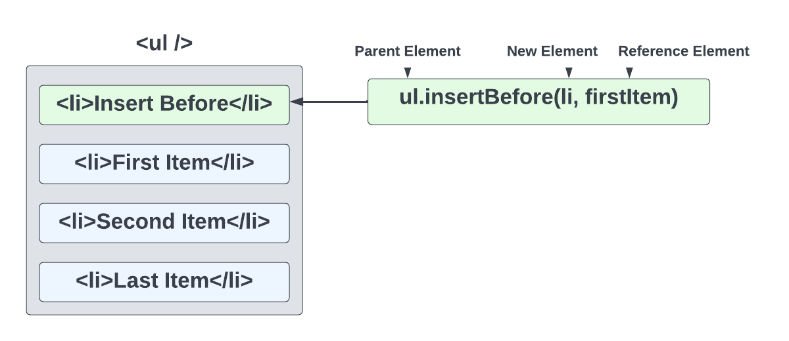

# Insert Elements, Text & HTML

We know how to select and create elements. We also learned how to insert an item into the DOM using `appendChild()`. There are other methods that we can use to insert elements, text and HTML into the DOM.

Let's use our shopping list and add some new items in specific positions.

## `insertAdjacentElement()`

`insertAdjacentElement()` as well as the next two methods work in a similar way. We call the method on the current element that we want to insert before or after. Then we pass in a position as the first argument, then our new custom element that we want to insert as the second argument.

The four position options are **beforebegin**, **afterbegin**, **beforeend**, **afterend**. The placement is as follows:

```
<!-- beforebegin -->
<p>
  <!-- afterbegin -->
  ###The content of the initial element###
  <!-- beforeend -->
</p>
<!-- afterend -->
```

Let's say we want to create an `h1` within our JS and insert it before the `filter input`. We will put this code in a custom function called `insertElement()`

```js
function insertElement() {
  const filter = document.querySelector('.filter');

  const h1 = document.createElement('h1');
  h1.textContent = 'insertAdjacentElement';

  filter.insertAdjacentElement('beforebegin', h1);
}

insertElement();
```

Now your `h1` is before the filter. You can change the position to play round with it.

## `insertAdjacentText()`

`insertAdjacentText()` works the same way except instead of inserting a custom element, we use it to insert text.

Let's insert some text before the first `li` element

```js
function insertText() {
  const item = document.querySelector('li:first-child');

  item.insertAdjacentText('beforebegin', 'insertAdjacentText');
}

insertText();
```

## `insertAdjacentHTML()`

`insertAdjacentHTML()` works the same way, but for straight HTML. It is similar to using `innerHTML`

Let's insert some HTML with an `h2` tag after the clear button

```js
function insertHTML() {
  const clearBtn = document.querySelector('#clear');

  clearBtn.insertAdjacentHTML('afterend', '<h2>insertAdjacentHTML</h2>');
}

insertHTML();
```

## `insertBefore()`

`insertBefore()` is called on the parent element and takes two arguments, the new element and the reference element. It will insert the new element before the reference element.

The following will add a new `li` element before the first `li` element

```js
const ul = document.querySelector('ul');

const li = document.createElement('li');
li.textContent = 'Insert Me Before!';

const firstItem = document.querySelector('li:first-child');

// Call on parent element
ul.insertBefore(li, firstItem);
```



## Custom `insertAfter()`

You would probably think that since there is an `insertBefore()` method, there would be an `insertAfter()` method. Unfortunately, there is not. This is one thing I miss about JQuery that JavaScript has not implemented.

Just because it doesn't exist doesn't mean that we can't create it.

```js
function insertAfter(newNode, existingNode) {
  existingNode.parentNode.insertBefore(newNode, existingNode.nextSibling);
}
```

The function above takes in a new node/element and an existing node/element and inserts the new node after the existing node. We could achieve this by using the `parentNode` and `nextSibling` properties of the existing node.

Now we can use this function to insert a new `li` element after the first `li` element.

```js
// Parent element
const ul = document.querySelector('ul');
// New element to insert
const li = document.createElement('li');
li.textContent = 'Insert Me After!';

// Reference element to insert after
const firstItem = document.querySelector('li:first-child');

insertAfter(li, firstItem);
```

You do have to be careful with this because, there is no parent, so if you your existing node selector matches other elements, you may run into an issue. Just be specific with your selectors.
