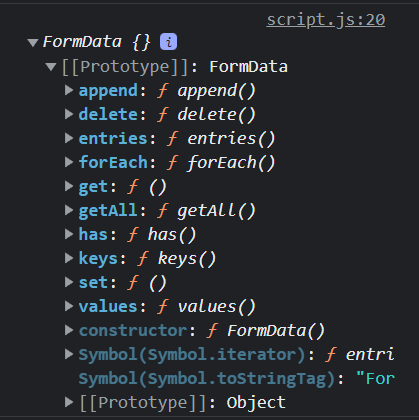

# Form Submission

In the last video we looked at events on specific input fields. Now I want to look at form submission,which includes the `submit` event.

## No Action

If you have any experience with server-side programming with a language such as PHP, then you know that you usually submit a form to a specific page using the `action` attribute. It may look something like this:

```html
<form action="/form-handler.php" method="post"></form>
```

When we are dealing with a form submission using front-end JavaScript, we don't have to worry about the `action` attribute. We actually want to prevent that type of submission, so that we can handle everything within JavaScript.

If you do need to submit the form to a backend or an API (to submit to a database, etc), you would do that from your JavaScript code by using the `fetch` API, which I will talk about in another section. So essentially, we are intercepting the form submission and preventing it.

## `submit` Event

Let's add some JavaScript to select the form and listen for a submit:

```js
const form = document.getElementById('item-form');

function onSubmit() {
  console.log('Form submitted');
}

form.addEventListener('submit', onSubmit);
```

If you submit the form, you will see the message in the console, but it will just flash for a second and then disappear. This is because the form submission is being handled by the browser using the `action` attribute by default. If there is no `action` attribute, then the browser will submit the form to the current page.

What we want to do is prevent the default behavior and if you remember, we already used the `preventDefault` method to do that in a past video. Let's do it here.

```js
function onSubmit(e) {
  e.preventDefault(); // Add this line

  console.log('Form submitted');
}
```

Now if you submit, you should see the message in the console, but it will not flash, it should stay there.

## Getting Form Data

There are a couple ways to get your form data. All form inputs have a `value` property that you can get.

Since our form only has a single text input, let's add a priority select input just for this video. Place this in the form:

```html
<select id="priority-input" name="priority" class="form-input">
  <option value="1">1</option>
  <option value="2">2</option>
  <option value="3">3</option>
</select>
```

We can get both input values by selecting the element and using the `value` property.

```js
function onSubmit(e) {
  e.preventDefault();

  const item = document.getElementById('item-input').value;
  const priority = document.getElementById('priority-input').value;

  console.log(item, priority);
}
```

Whatever we type in the item input will now be in the `item` variable and whatever we select as a priority will be in the `priority` variable. So we could use that to do some validation, submit it to some kind of API, etc.

Let's add a little validation. We don't want to be able to submit an empty item. We also don't want to submit an item with a priority of 0.

```js
function onSubmit(e) {
  e.preventDefault();
  const item = document.getElementById('item-input').value;
  const priority = document.getElementById('priority-input').value;

  if (item === '' || priority === '0') {
    alert('Please fill in all fields');
    return;
  }

  console.log('Adding Item...');
}
```

If the validation does not pass, we show an alert box and return from the function. So nothing else happens. If it does pass, it will go on to the console log.

## `FormData` Object

The `FormData` object is a special type of object that is used to collect form data. This is a bit more difficult than the previous method.

Let's create another function called `onSubmit2` and call that on form submission. Then create the new `FormData` object and log it.

```js
function onSubmit2(e) {
  e.preventDefault();

  const formData = new FormData(form);

  console.log(formData);
}

form.addEventListener('submit', onSubmit2);
```



As you can see, there are a bunch of methods in the prototype. We can use the `get` method to get the value of a specific input.

```js
function onSubmit2(e) {
  e.preventDefault();

  const formData = new FormData(form);
  const item = formData.get('item');
  const priority = formData.get('priority');

  console.log(item, priority);
}
```

We can get all of the form data by using the `entries` method. This will return an array of arrays, where each array is a pair of values. We can see them by using a `for of` loop.

```js
function onSubmit2(e) {
  e.preventDefault();

  const formData = new FormData(form);
  const entries = formData.entries();

  for (let entry of entries) {
    console.log(entry);
  }
}
```

There is a lot more we can do with the `FormData` object, but it is beyond the scope of what we are doing. I just figured I would throw it in here because it is another way to get your form values.

Before we move on to making our shopping list actually work, there are a few more things we need to talk about that have to do with events. In the next video, we'll talk about event bubbling and event delegation.
