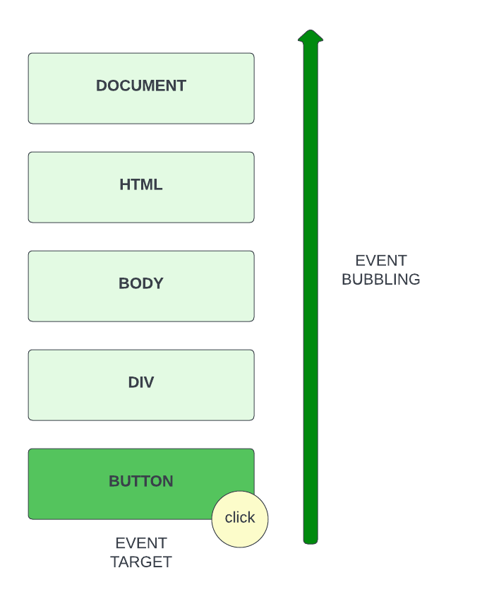

# Event Bubbling

In this video, we're going to talk about something that is pretty important when it comes to handling events and that's event bubbling.

When we add an event listener to an element, that event moves up the DOM tree and if it finds a parent element that has a listener for that event, it will fire it.



So even if we click on the button, the event will bubble up all the way up the document.

Let me show you exactly what I mean instead of trying to explain it.

Let's use our shopping list example and in the JavaScript, let's select the add item button in the form and add an event listener to it.

```JavaScript
const button = document.querySelector('form button');

button.addEventListener('click', () => {
  alert('Button was clicked.');
});
```

So we click on the button and we get an alert. No big deal. Now, let's bring in it's parent `div` and add an click event listener to it.

````JavaScript

```JavaScript
const div = document.querySelector('form div:nth-child(2)');

div.addEventListener('click', (e) => {
  alert('Div was clicked.');
});
````

Now click to the right of the button and you should see **Div was clicked.** as to be expected.

Now click on the button. You'll get the initial button alert, but then you'll get the div alert. This is because the event is bubbling up the DOM tree.

Now let's add a click event on to the parent form.

```JavaScript
const form = document.querySelector('form');

form.addEventListener('click', (e) => {
  alert('Form was clicked.');
});

```

Now click on the button. You'll get the initial button alert, then the form alert, then the div alert.

Finally, let's ass a click event on to the document body.

```JavaScript
document.body.addEventListener('click', (e) => {
  alert('Body was clicked.');
});
```

There will be times where you'll need to understand this to be able to achieve certain results.

Now there may be cases where you'll want to stop the event from bubbling up the DOM tree. What if you have a legit click event on the `button` and also on the `div`, but you don't want the `div` to fire the event?

That's where `stopPropagation()` comes in. This is a method on the `Event` object that you can call on an event to stop it from bubbling up the DOM tree.

Let's add it to our `button` event handler.

```JavaScript
button.addEventListener('click', (e) => {
  alert('Button was clicked.');
  e.stopPropagation();
});
```

Now if you click on the button, it will not fire off the `div` event or any others above it. You can still click on the `div` and it will fire off. It will also bubble up from there because we didn't call `stopPropagation()`.

You should only call `stopPropagation()` if you have a reason for it. For instance if we actually had a parent and child with the same event listener.

There is also a method called `stopImmediatePropagation()`. This is used if you have multiple handlers on a single event and you want to stop the event for all of them.

Now that you know how bubbling works, in the next video, we'll talk about event delegation.
