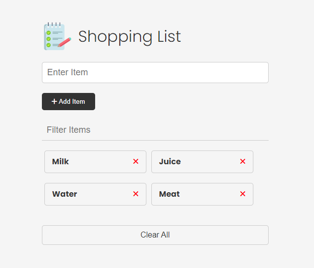

# Shopping List Project Intro

Alright, so we have been working with the shopping list UI for a while. Now it's time to actually build it out and add the functionality. It may seem like a simple app, but we'll be writing about 200+ lines of code. When you don't use a framework, you have to account for everything. If you change the look of a button, you have to make sure it gets changed back to it's default state. Frameworks make things easier, by repainting the UI and stuff like that, but learning how to do things the vanilla way will make it that much easier for you to learn React or any other frontend framework.



Let's look at the specs for this project:

## Project Specs

- Add items to the list via the form
- Remove items from the list by clicking the "X" button
- Clear all of the items from the list with the "Clear All" button
- Filter the items by typing into the filter input field
- Add localStorage functionality to persist the list
- Click on an item to put the text into the input field and change the button to "Update"
- Update an item by clicking the "Update" button
- Add validation and check to see if the item already exists in local localStorage

I know we haven't talked about local storage yet, but I'm going to give you a little crash course before we add it to the project. Remember, everything that we have done so far is all frontend and related to the DOM. If we submit the form and add an item to the `ul`, it's only for that frame. If we reload the page, it goes back to the default. We're not persisting the data anywhere. Many times you'll submit the form and use something like the `fetch` API to send the data to a server and get saved in a database. Another option you have is to save the data locally and that's what local storage is for. So that if we refresh the page, we still have the data there.

Let's take a quick look at the HTML and CSS.

### HTML

The HTML is pretty simple and you probably have it memorized by now. We have a header then a form with an input for an item. We have a filer input to filter items. Of course, we have the item list and each item has the name as well as the "X" button to remove the item. We are using font-awesome for icons. I just included the CDN link in the `head`, that way we can just add classes to use icons. We also have a clear button to remove all of the items.

```html
<!DOCTYPE html>
<html lang="en">
  <head>
    <meta charset="UTF-8" />
    <meta http-equiv="X-UA-Compatible" content="IE=edge" />
    <meta name="viewport" content="width=device-width, initial-scale=1.0" />
    <link
      rel="stylesheet"
      href="https://cdnjs.cloudflare.com/ajax/libs/font-awesome/6.1.2/css/all.min.css"
      integrity="sha512-1sCRPdkRXhBV2PBLUdRb4tMg1w2YPf37qatUFeS7zlBy7jJI8Lf4VHwWfZZfpXtYSLy85pkm9GaYVYMfw5BC1A=="
      crossorigin="anonymous"
      referrerpolicy="no-referrer"
    />
    <link rel="stylesheet" href="css/style.css" />
    <title>Shopping List</title>
  </head>
  <body>
    <div class="container">
      <header>
        
        <h1 id="app-title">Shopping List</h1>
      </header>
      <form id="item-form">
        <div class="form-control">
          <input
            type="text"
            class="form-input"
            id="item-input"
            placeholder="Enter Item"
          />
        </div>
        <div class="form-control">
          <button type="submit" class="btn">
            <i class="fa-solid fa-plus"></i> Add Item
          </button>
        </div>
      </form>

      <div class="filter">
        <input
          type="text"
          class="form-input-filter"
          id="filter"
          placeholder="Filter Items"
        />
      </div>

      <ul id="item-list" class="items">
        <li>
          Apples
          <button class="remove-item btn-link text-red">
            <i class="fa-solid fa-xmark"></i>
          </button>
        </li>
        <li>
          Orange Juice
          <button class="remove-item btn-link text-red">
            <i class="fa-solid fa-xmark"></i>
          </button>
        </li>
        <li>
          Oreos
          <button class="remove-item btn-link text-red">
            <i class="fa-solid fa-xmark"></i>
          </button>
        </li>
        <li>
          Milk
          <button class="remove-item btn-link text-red">
            <i class="fa-solid fa-xmark"></i>
          </button>
        </li>
      </ul>

      <button id="clear" class="btn-clear">Clear All</button>
    </div>

    <script src="js/script4.js"></script>
  </body>
</html>
```

### CSS

The CSS is very simple as well. I didn't use any framework like Tailwind or Bootstrap. I just used a plain old CSS file.

```css
@import url('https://fonts.googleapis.com/css2?family=Poppins:wght@300;400;700&display=swap');

*,
*::before,
*::after {
  margin: 0;
  padding: 0;
  box-sizing: border-box;
}

body {
  font-family: 'Poppins', sans-serif;
  font-size: 16px;
  line-height: 1.5;
  color: #333;
  background-color: #f5f5f5;
}

header {
  display: flex;
  justify-content: flex-start;
  align-items: center;
  margin-bottom: 20px;
}

header h1 {
  font-weight: 300;
  margin-left: 10px;
}

.container {
  max-width: 500px;
  margin: 30px auto;
  padding: 20px;
}

/* Form & Input */
.form-input {
  width: 100%;
  font-size: 18px;
  margin-bottom: 20px;
  padding: 10px;
  border: 1px solid #ccc;
  border-radius: 5px;
  outline: none;
}

.form-input-filter {
  margin-top: 20px;
  width: 100%;
  font-size: 18px;
  margin-bottom: 20px;
  padding: 10px;
  border: none;
  border-bottom: 1px solid #ccc;
  background: transparent;
  outline: none;
}

/* Buttons */
.btn {
  background-color: #333;
  color: #fff;
  border: none;
  border-radius: 5px;
  padding: 10px 20px;
  cursor: pointer;
}

.btn:hover {
  background-color: #444;
}

.btn-link {
  font-size: 16px;
  background-color: transparent;
  color: #333;
  border: none;
  padding: 0;
  cursor: pointer;
}

.btn-clear {
  margin-top: 20px;
  width: 100%;
  font-size: 16px;
  background-color: transparent;
  color: #333;
  border: 1px solid #ccc;
  border-radius: 5px;
  padding: 10px 20px;
  cursor: pointer;
}

.btn-clear:hover {
  background-color: #f1f1f1;
}

.text-red {
  color: red;
}

/* Items */

.items {
  margin-top: 20px;
  display: flex;
  flex-wrap: wrap;
}

.items li {
  display: flex;
  justify-content: space-between;
  width: 45%;
  border: 1px solid #ccc;
  border-radius: 5px;
  padding: 10px 15px;
  margin: 0 5px 20px;
  font-weight: 700;
  cursor: pointer;
}

@media (max-width: 500px) {
  .items li {
    width: 100%;
  }
}
```
