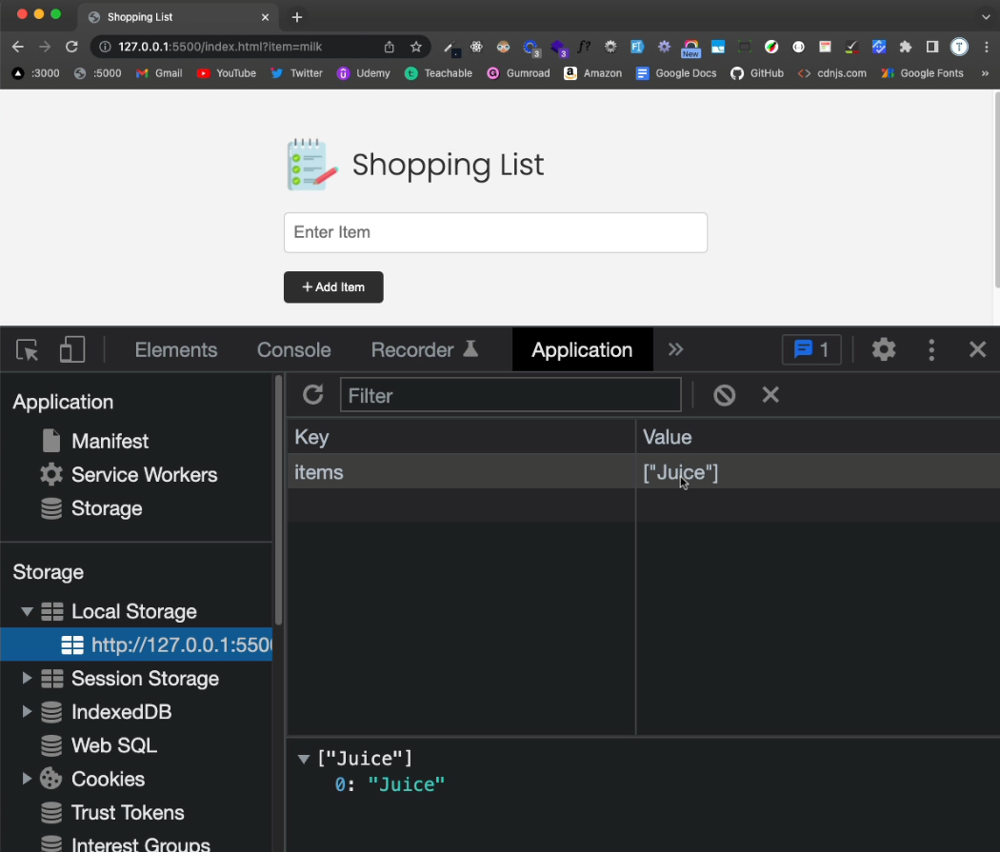

# Add Items To LocalStorage

Now that we have add, remove, clear and filter working in the DOM, we need to be able to persist the items to localStorage in the browser.

I am going to refactor the code a bit to make it easier to work with. Instead of having the submit event call a function called `addItem`, I am going to change the name of that function to `onAddItemSubmit()` and then call that function from the submit event.

```js
itemForm.addEventListener('submit', onAddItemSubmit);
```

The part of the function where we add the item to the DOM, I am going to remove and put in it's own function called `addItemToDOM()`.

```js
function onAddItemSubmit(e) {
  e.preventDefault();

  const newItem = itemInput.value;

  // Validate Input
  if (newItem === '') {
    alert('Please add an item');
    return;
  }

  // Create item DOM element
  addItemToDOM(newItem);

  checkUI();

  itemInput.value = '';
}
```

```js
function addItemToDOM(item) {
  // Create list item
  const li = document.createElement('li');
  li.appendChild(document.createTextNode(item));

  const button = createButton('remove-item btn-link text-red');
  li.appendChild(button);

  // Add li to the DOM
  itemList.appendChild(li);
}
```

## Adding items to localStorage

Now we will create a function to add the items to localStorage. We will call it right after we add the item to the DOM.

```js
function addItemToStorage(item) {
  let itemsFromStorage;

  if (localStorage.getItem('items') === null) {
    itemsFromStorage = [];
  } else {
    itemsFromStorage = JSON.parse(localStorage.getItem('items'));
  }

  // Add new item to array
  itemsFromStorage.push(item);

  // Convert to JSON string and set to local storage
  localStorage.setItem('items', JSON.stringify(itemsFromStorage));
}
```

```js
function onAddItemSubmit(e) {
  // ...

  // Create item DOM element
  addItemToDOM(newItem);

  // Add item to local storage
  addItemToStorage(newItem);
}
```

Now, when you add an item, it will get added to `items` in localStorage. You can check this by going to your application tab in the dev tools and clicking on the `Local Storage` tab.


