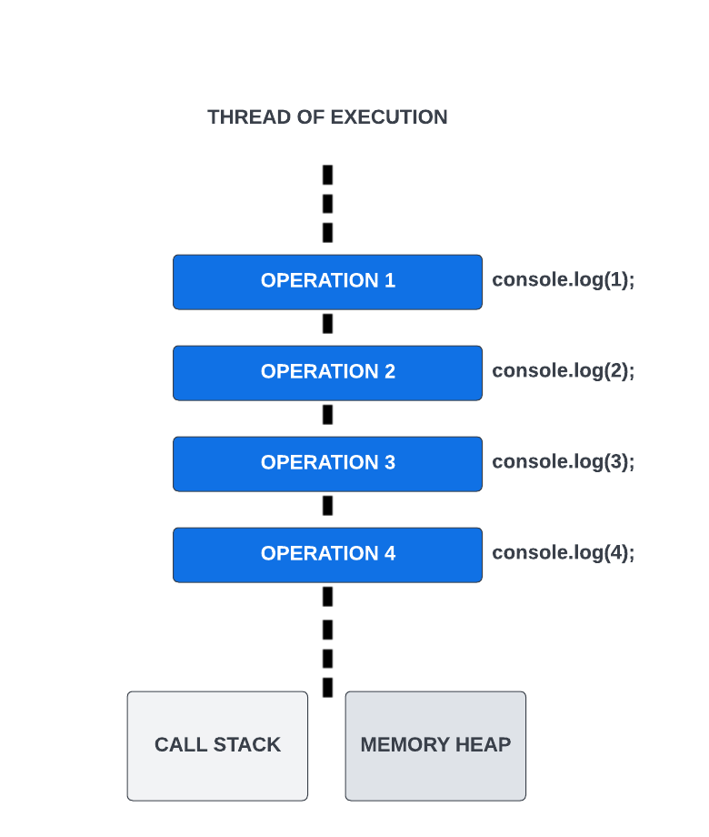

# Thread Of Execution

## JavaScript is Synchronous

So, we have covered a lot of the fundamentals of JavaScript and how to work with the Document Object Model (DOM). Now we are going to start to get into asynchronous JavaScript. Before we do that though, it is important to understand how JavaScript actually works and to understand that at it's core, JavaScript is a `synchronous` and `single-threaded` language. It has `asynchronous` capabilities, which we will be looking at in this section and others, but it is not `asynchronous` by default.

## JavaScript is Single-Threaded

You already have a leg up on this stuff, because you know about the `execution context`. We talked about that earlier in the course. The `execution context` contains the currently running code and everything that aids in its execution. It also runs on what we call a `thread of execution`. The `thread of execution` is a single thread that **runs one line of code at a time**. This is why JavaScript is a `single-threaded` language and is `synchronous`. Some languages have multiple threads that can run code at the same time. JavaScript does not.

If we look at this image, it shows the `thread of execution`, which is a single sequential flow of control and each operation happens one after the other. The second console.log() will not run until the first one is finished. The third will not run until the second is finished. This is `synchronous` behavior. The thread also includes the call stack and memory heap, which we've already talked about.

So that's really all I want you to understand up to this point is that everything is executed line by line. In the next video, I'll show you how it is possible to run code asynchronously with the help of web APIs.
