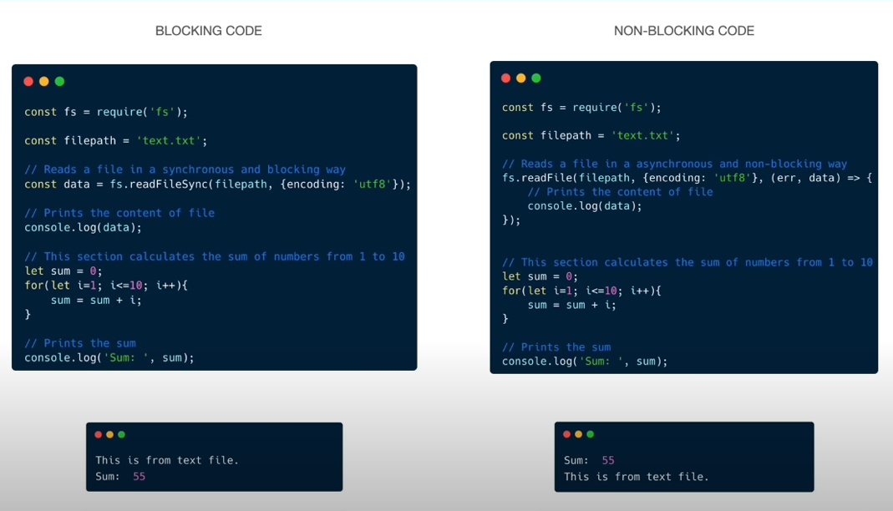
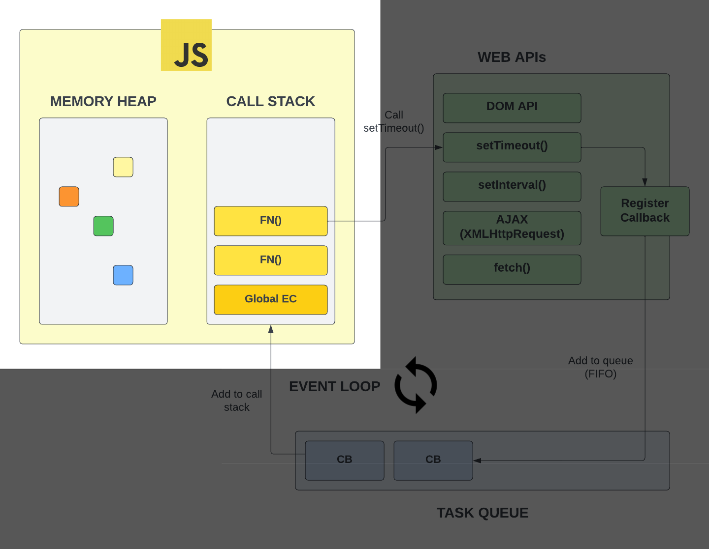
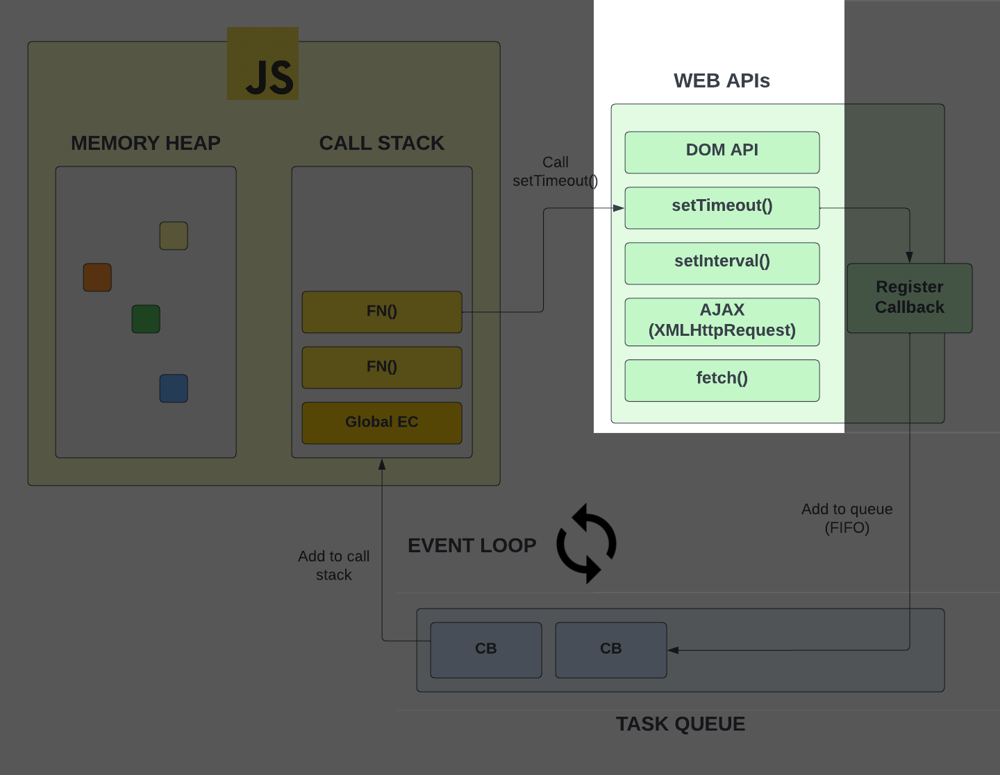
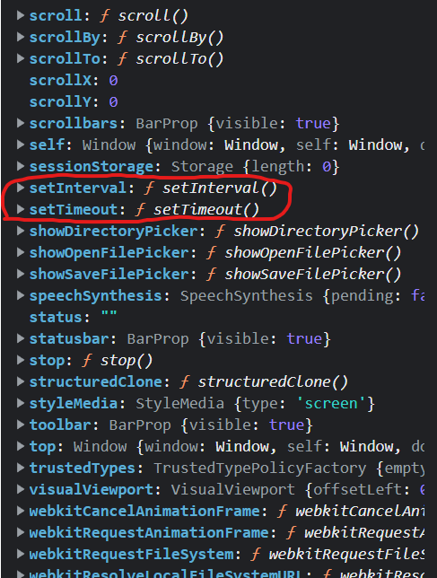
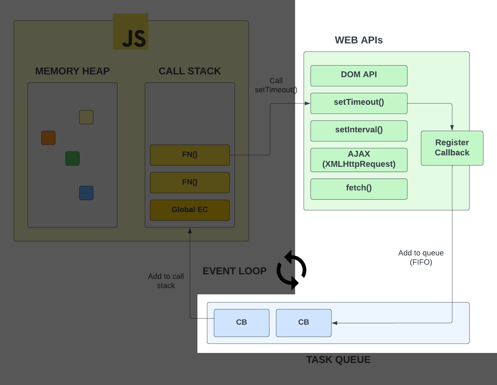
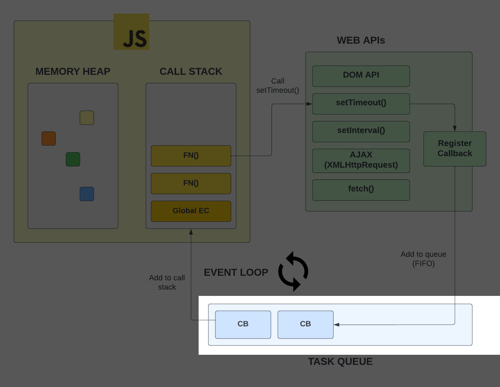
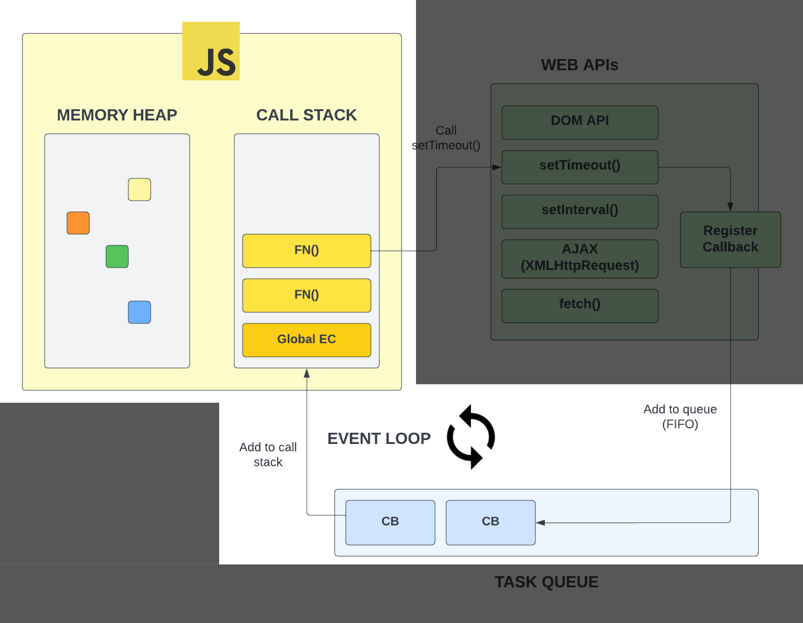
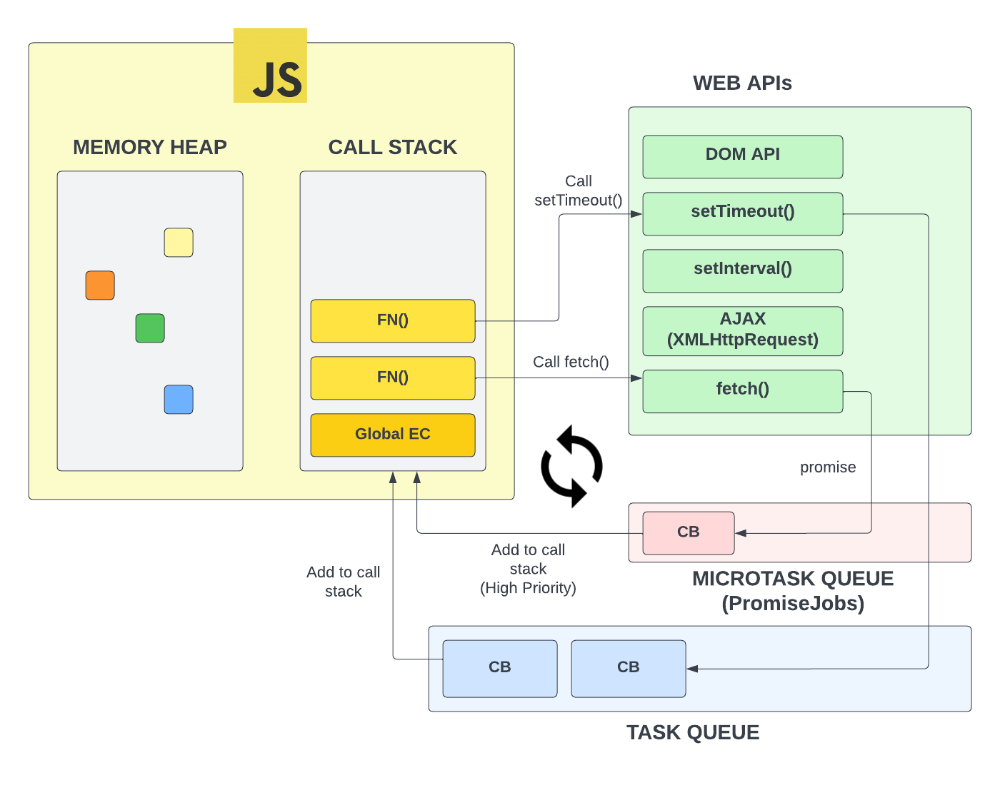

# How Asynchronous JavaScript Works: The Task Queue & Event Loop

Alright, so I just want to warn you that I'm going to throw a lot of information at you in this video because I'm basically going to explain everything that happens behind the scenes when we create asynchronous code. If this confuses you, don't worry about it. You'll learn more about the behind the scenes stuff as well as the syntax throughout the course.

So you know that JavaScript is a `synchronous` and it's a `single-threaded` language. It runs one line of code at a time. Just to remind you, we can look at the image we talked about in the last video.

These operations run line by line and each one has to wait for the last one to complete before executing. Where we run into issues is where one of these operations takes a while. Something like fetching data from a server or if you're using Node.js, maybe you're reading from or writing to a file. That can take a while, and by a while, I mean usually a few seconds or even a few milliseconds, but that's a long time in programming.

## Blocking & Non-Blocking Code

When an operation takes a while and basically holds up the line, that is called `blocking` code or operations. It blocks the flow of the program until it completes. `Non-blocking`code refers to code that does not block execution.

Let's look at the following code. Don't worry if you don't understand everything, but both pieces of code are reading a file using Node.js file system methods and then calculating the sum of numbers from 1 to 10.

On the left, we are using the `readFileSync()` method. This is a blocking method. It will read the file and then move on to calculate the sum. In the console, we see the file contents and then the sum.

On the right, we are using the `readFile()` method. This is a non-blocking, asynchronous method. It will read the file but it will not block the execution of the program by making it wait. The way it works, is it takes in a callback function and when the file is read, it will execute the callback function. In the console, we see the sum first and then the file contents, because we did not have to wait for the file to be read before calculating the sum.

Now `readFile()` is not available to us in the browser, but there are a lot of APIs that are available that work in a similar asynchronous way.

I'm going to show you a diagram to try and explain what happens when we write asynchronous code using these web APIs.

The yellow box represents the `JavaScript engine`. This is the part of the browser that executes our JavaScript code. This is where our `call stack` is that executes all of our functions, etc. This is also where the `memory heap` is, which is where all of our variables and objects are stored.

Outside of that, in the green box, we have a bunch of web APIs that are accessible to us via the browser and the `global object`. Remember, this is created during the _creation phase_ of the `global execution context`.

If we go to the browser console and type in `window` and hit enter, you will see `setTimeout()` and `setInterval()` and a bunch of other functions that allow us to do things asynchronously.

In addition to `setTimeout()` and `setInterval()`, we have the whole DOM API. We select elements and put event listeners on them. That's another API we have available to us. it's not part of JavaScript. When you use Node.js, you don't have access to the document object, because there is no DOM or browser in Node.js. But as you saw in the code examples, in Node, you do have access to the filesystem API, which allows you to read and write files.

`fetch()` is another API that we have access to. It allows us to make HTTP requests. We'll be working with the fetch API quite a bit to send requests to APIs and services. This is something that a front-end developer has to know how to use, and we'll get to that soon enough.

Right now, I just want you to understand that this is stuff provided to us by the browser environment. Now, let's talk about how they work with the JavaScript engine, which is inherently synchronous.

## Task Queue

So we know these APIs are separate from the JavaScript engine. We know that we have the ability to go off and do something while the script continues to execute and when that something is done, we fire off a callback function. This is possible because of something called the `task queue`.

When we call an asynchronous function such as `setTimeout()`. In the diagram it's being called from a function, but it could just as well be from the global scope. When we call it, we added a callback function as an argument. It then registers that callback and it gets added to what we call a `task queue`. This is a queue of callbacks that are waiting to be added to the call stack and executed.

A `queue` is a data structure that follows the `first in, first out` principle. This means that the first item that is added to the queue will be the first item that is removed from the queue. In our case, the first callback that is added to the task queue will be the first callback that is executed.

Remember, we already looked at a `stack`, which follows the `last in, first out` principle. This means that the last item that is added to the stack will be the first item that is removed. The `call stack` is an example. So both `queues` and `stacks` are data structures that are used in programming.

## Event Loop

Any callbacks that are in the queue, have to be put on the stack to be executed. This is where the `event loop` comes in. The event loop is a process that checks the call stack and the task queue. If the call stack is empty, it will take the first callback in the task queue and add it to the call stack to be executed. When we create event listeners with `addEventListener()`, we are also adding callbacks to the task queue.

You can think of the event loop like one of those revolving doors at the mall. It's constantly checking to see if the door is open and if it is, it will let people in. If it's not, it will keep spinning until it is. In this case, we're dealing with functions instead of people.

Now this is also how the event loop and the task queue work within Node.js. There are different APIs and functions available, but it all works the same under the hood. Node even uses the same V8 engine that Chrome uses.

## Promises

Now Just to confuse you a little bit more, with things like event listeners and `setTimeout()`, callbacks get added to the task queue. When we work with let's say, the `fetch` API, we get a `Promise` object back, which work a little differently.

Promises are objects that represent the eventual completion or failure of an asynchronous operation. They are a way to handle asynchronous code in a more elegant way than using callbacks. We'll be working with promises a lot in the future. The reason I'm mentioning them now is because promises create what are called `PromiseJobs` or the v8 engine calls them `microtasks`.

Microtasks are callbacks that are added to the `microtask queue`. It works in a similar way to the task queue, but it's a separate queue and it's checked before the task queue. It has a higher priority. There are also something called `observers` that are added to the microtask queue. We'll get to those later.

Alright, I know this is confusing as hell, but the truth is, you don't need to understand all of this right now. In fact, I know senior developers that don't know some of this stuff, but I wanted you to get a head start on what is actually happening under the hood.
