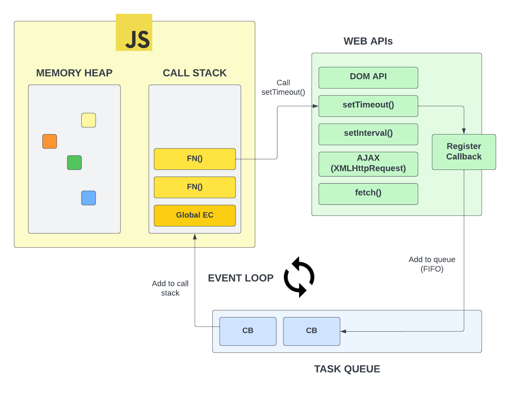

# `setTimeout()` and `clearTimeout()`

In the last video, we looked at a diagram that represented what actually happens under the hood when we use some of the asynchronous APIs that the browser or Node.js offers. In this video, we're going to look at `setTimeout()`, which is really helpful for doing something after a certain amount of time. We're also going to look at `clearTimeout()`, which is a function that we can use to cancel a timeout.

```js
setTimeout(function () {
  console.log('Hello from callback');
}, 2000);

console.log('Hello from the top-level code');
```

When we run this code, we see the following output.

```
Hello from the top-level code
Hello from callback
```

The reason for this is because setTimeout() is given a number of milliseconds as the second argument and then it waits that amount of time and fires off. It does not block the code though, so we see the top-level console log first and then the callback console log.

Let's go ahead and change the 2000 milliseconds to `0`. What do you think is going to happen?

```js
setTimeout(function () {
  console.log('Hello from callback');
}, 0);

console.log('Hello from the top-level code');
```

When we run this code, we see the following output.

```
Hello from the top-level code
Hello from callback
```

You may have thought that the callback would execute first since we set the timeout to 0. Remember, that callback gets put on to the `task queue` and then it waits for the call stack to be empty. So, the callback is not going to execute until the call stack is empty, even if we set the timeout to 0. Just to remind you, here is the diagram that we looked at in the last video.



You may want to use this to change something in the DOM after a certain amount of time. We did this in the loan calculator project to show a spinner for 1 second before showing the results.

Let's make the `h1` tag change after a few seconds.

```js
setTimeout(() => {
  document.querySelector('h1').textContent = 'Hello from callback';
}, 3000);
```

We could also put that in a separate function and then call it.

```js
function changeText() {
  document.querySelector('h1').textContent = 'Hello from callback';
}

setTimeout(changeText, 3000);
```

## `clearTimeout()`

In addition to `setTimeout()`, we also have `clearTimeout()`. This is a function that we can use to cancel a timeout.

Let's create a button that will cancel the timeout to change the text.

```html
<button id="cancel">Cancel Text Change</button>
```

In order to know which timeout to cancel, we need to store the id that is returned from `setTimeout()`.

```js
const timerId = setTimeout(changeText, 3000);
```

Now, we can create an event listener for the button that will call `clearTimeout()`.

```js
document.querySelector('#cancel').addEventListener('click', () => {
  clearTimeout(timerId);
  console.log('Timer Cancelled');
});
```
