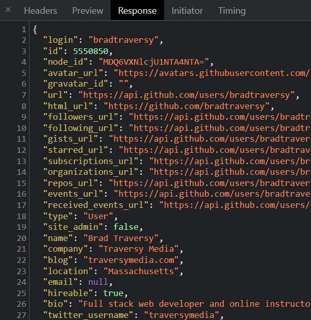

# AJAX & XHR (XMLHttpRequest)

So when we make a request to a server or some kind of data API, we will usually use the `fetch` API. Any project we do in this course, that's what we'll be doing. But it's important to know that there's another way to do it, and that's with the `XMLHttpRequest` object. This is the older way of doing it, but you should at least know the basics just in case you run into it. It will also help you understand more about callbacks, etc.

## XMLHttpRequest

The `XMLHttpRequest` object is a built-in browser object that allows us to make HTTP requests. It's a little more complicated than the `fetch` API, but it's still pretty straightforward. You may notice `XML` is included in the name of the object. AJAX also stands for "Asynchrounous JavaScript and XML". This is because years ago when this was created, XML was the common data format we used. These days you almost never see XML, instead we work with JSON, which is much simpler and cleaner.

Let's look at the following diagram to see how this works:


So we have our client, which is our browser, and we have the server or third-party API that we want to communicate with via HTTP request. This could also just be a file on your file system.

Like I said before, when we visit a webpage, we are making an HTTP request. That is what is demonstrated on the left.

What AJAX and the XHR object allow us to do is make those same types of requests via JavaScript. So from our code we make a call using the AJAX engine and XHR object. It sends a request behind the scenes without refreshing the page. Then we get back JSON or XML data in a response and we can then update the dom with that data. So all this happens behind the scenes without the user having to refesh the page.

Let's look at an example of how we do this within our code:

```js
const xhr = new XMLHttpRequest();

xhr.open('GET', 'https://api.github.com/users/bradtraversy');

xhr.onreadystatechange = function () {
  if (this.readyState === 4 && this.status === 200) {
    console.log(JSON.parse(this.responseText));
  }
};

xhr.send();
```

Let's go through bit-by-bit.

First, we create a new `XMLHttpRequest` object. This is the object that we'll use to make the request.

```js
const xhr = new XMLHttpRequest();
```

Next, we use the `open()` method to initialize the request. We pass in the type of request we want to make, and the URL we want to make the request to. You can also pass in a third parameter to specify whether the request should be made asynchronously or not. This is `true` by default, but we can set it to `false` if we want to make a synchronous request, which will block the rest of the code from running until the request is complete. We won't be doing this in this course, but it's good to know that it's possible.

```js
xhr.open('GET', 'https://api.github.com/users/bradtraversy');
```

Then we use the `onreadystatechange` event handler to listen for the `readystatechange` event. This event will fire every time the `readyState` changes. We can use this to check the status of the request. You can also use addEventListener() to listen for the event.

readyState has 5 possible values:

- 0: request not initialized
- 1: server connection established
- 2: request received
- 3: processing request
- 4: request finished and response is ready

We want to check that the `readyState` is 4, and that the `status` is 200, which means everything is OK. If the `status` is not 200, then there was an error. We use the `this` keyword to refer to the `XMLHttpRequest` object.

We can see what the values are every time the status changes:

```js
console.log(this.readyState, this.status);
```

The data that we get back will be in the `responseText` property. We can use `JSON.parse()` to convert it to a JavaScript object.

```js
xhr.onreadystatechange = function () {
  if (this.readyState === 4 && this.status === 200) {
    console.log(JSON.parse(this.responseText));
  }
};
```

Finally, we use the `send()` method to send the request.

```js
xhr.send();
```

We will see the data in the console, but you can also look in your devtools `network` tab. You should see a request to the GitHub API. Click on it and you should see the response.

  

If you want to try getting all of the GiHub repos for a user, you can use the following URL:

```js
xhr.open('GET', 'https://api.github.com/users/bradtraversy/repos');
```

Instead of getting back an object, you will get back an array of objects.

Let's output the data to the page. We can use the `forEach()` method to loop through the array of repos. We can then create a list item for each repo and append it to the page.

```js
xhr.onreadystatechange = function () {
  if (this.readyState === 4 && this.status === 200) {
    const data = JSON.parse(this.responseText);

    data.forEach((repo) => {
      const li = document.createElement('li');
      li.innerHTML = `<strong>${repo.name}</strong> - ${repo.description}`;
      document.querySelector('ul').appendChild(li);
    });
  }
};
```

It is important to understand that whatever you get back from an API is up to the server-side developer. So you may get back a different format of data, or different properties, etc. What they chose to send back will be accessible in the `responseText` property.

So now that we know how to make a simple request, in the next video, we're going to create a little joke generator app using the Chuck Norris Jokes API.
