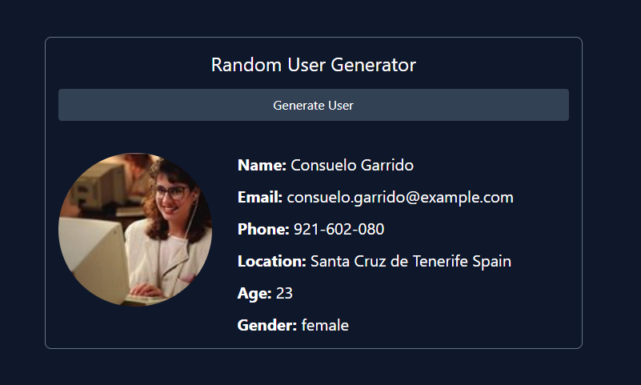

# Random User Generator Challenge

Before we move on to fetch options and making other types of requests, I want to do a mini project using the [Random User API](https://randomuser.me/). We are going to be able to click a button and fetch a random user and put their info on the page including their picture, name, email, phone, location, age and gender.



If you think you are ready to try this on your own, We already have the HTML and CSS for the project. You just need to add the JavaScript to add an event listener to the button, fetch the user and display them on the page. We'll be using the same HTML structure as the harcoded HTML, we will just replace the values with data coming from the API.

Alright, let's get started!

### Get Elements & Add Event Listener

First, we will get the generate button, the user result element and the loader element. Then we will add an event listener to the button.

```js
const generateBtn = document.querySelector('#generate');
const userEl = document.querySelector('#user');
const loadingEl = document.querySelector('#loading');

generateBtn.addEventListener('click', () => {
  console.log('Fetch User...);
});

```

Make sure that works by clicking the button and checking the console. You should see the message.

Now, let's make the request to the API endpoint, which is `https://randomuser.me/api/`.

```js
generateBtn.addEventListener('click', () => {
  fetch('https://randomuser.me/api/')
    .then((res) => res.json())
    .then((data) => {
      // console.log(data);
    });
});
```

You should see the data in the console. It is an array with a single object. We need to get the object out of the array. We can do that by using [0]:

```js
generateBtn.addEventListener('click', () => {
  fetch('https://randomuser.me/api/')
    .then((res) => res.json())
    .then((data) => {
      const user = data.results[0];
      console.log(user);
    });
});
```

Now, we can start displaying the user data on the page. You can basically copy everything that is in the `#user` div in the HTML and then add it to the `div` via JavaScript with the values from the API response:

```js
generateBtn.addEventListener('click', () => {
  fetch('https://randomuser.me/api/')
    .then((res) => res.json())
    .then((data) => {
      const user = data.results[0];

      userEl.innerHTML = `
      <div class="flex justify-between">
      <div class="flex">
        
        <div class="space-y-3">
          <p class="text-xl">
            <span class="font-bold">Name: </span>${user.name.first} ${user.name.last}
          </p>
          <p class="text-xl">
            <span class="font-bold">Email: </span> ${user.email}
          </p>
          <p class="text-xl">
            <span class="font-bold">Phone: </span> ${user.phone}
          </p>
          <p class="text-xl">
          <span class="font-bold">Location: </span> ${user.location.city} ${user.location.country}
        </p>
          <p class="text-xl"><span class="font-bold">Age: </span> ${user.dob.age}</p>
          <p class="text-xl">
            <span class="font-bold">Gender: </span>${user.gender}
          </p>
        </div>
      </div>
    </div>
      `;
    });
});
```

It's up to you if you want to remove the initial user from the HTML code. I left it, but commented it out.

### Show Loading Spinner

If you want to show the spinner, add a link to the stylesheet in the `head` tag right above the Tailwind CDN. Then add a function to show and hide the spinner. It is set to `display: none` in the CSS, so we will just change that to `display: block` when we want to show it:

```js
function showSpinner() {
  loadingEl.style.display = 'block';
}

function hideSpinner() {
  loadingEl.style.display = 'none';
}
```

Now, add it to the event listener:

```js
generateBtn.addEventListener('click', () => {
  showSpinner();

  fetch('https://randomuser.me/api/')
    .then((res) => res.json())
    .then((data) => {
      hideSpinner();
      const user = data.results[0];
      // console.log(data);

      userEl.innerHTML = `
      <div class="flex justify-between">
      <div class="flex">
        
        <div class="space-y-3">
          <p class="text-xl">
            <span class="font-bold">Name: </span>${user.name.first} ${user.name.last}
          </p>
          <p class="text-xl">
            <span class="font-bold">Email: </span> ${user.email}
          </p>
          <p class="text-xl">
            <span class="font-bold">Phone: </span> ${user.phone}
          </p>
          <p class="text-xl">
          <span class="font-bold">Location: </span> ${user.location.city} ${user.location.country}
        </p>
          <p class="text-xl"><span class="font-bold">Age: </span> ${user.dob.age}</p>
          <p class="text-xl">
            <span class="font-bold">Gender: </span>${user.gender}
          </p>
        </div>
      </div>
    </div>
      `;
    });
});
```

I prefer to break my code up into smaller functions. This is optional, but I'm going to create a function to fetch the user and another to display the user. I also like to put my event listeners at the bottom. Here is the final result:

```js
const generateBtn = document.querySelector('#generate');
const userEl = document.querySelector('#user');
const loadingEl = document.querySelector('#loading');

function fetchUser() {
  showSpinner();
  fetch('https://randomuser.me/api/')
    .then((res) => res.json())
    .then((data) => {
      hideSpinner();
      const user = data.results[0];
      displayUser(user);
    });
}

function displayUser(user) {
  userEl.innerHTML = `
      <div class="flex justify-between">
      <div class="flex">
        
        <div class="space-y-3">
          <p class="text-xl">
            <span class="font-bold">Name: </span>${user.name.first} ${user.name.last}
          </p>
          <p class="text-xl">
            <span class="font-bold">Email: </span> ${user.email}
          </p>
          <p class="text-xl">
            <span class="font-bold">Phone: </span> ${user.phone}
          </p>
          <p class="text-xl">
          <span class="font-bold">Location: </span> ${user.location.city} ${user.location.country}
        </p>
          <p class="text-xl"><span class="font-bold">Age: </span> ${user.dob.age}</p>
          <p class="text-xl">
            <span class="font-bold">Gender: </span>${user.gender}
          </p>
        </div>
      </div>
    </div>
      `;
}

function showSpinner() {
  loadingEl.style.display = 'block';
}

function hideSpinner() {
  loadingEl.style.display = 'none';
}

generateBtn.addEventListener('click', fetchUser);
```

That's it! Now we have a random user generator.

What I want to talk about next is error handling with the Fetch API.
