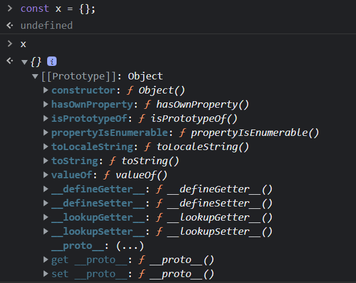
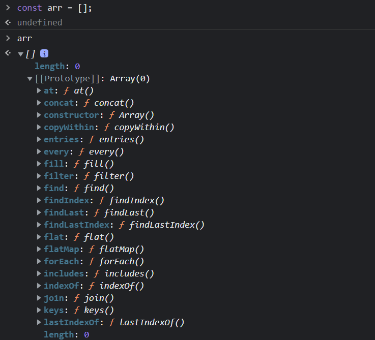
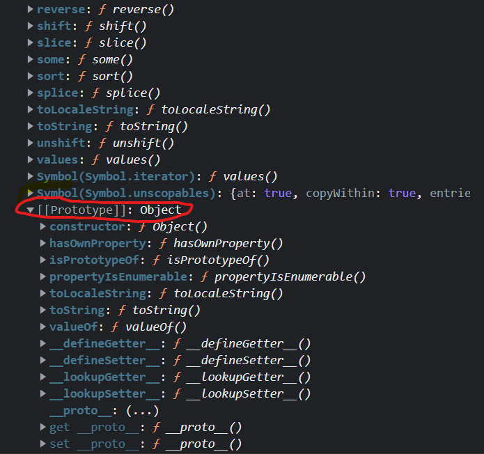
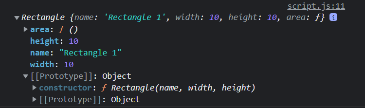
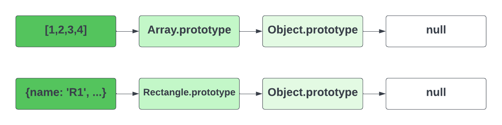

# Prototypes & The Prototype Chain

Alright, so now we're going to look at everyone's favorite topic, `prototypes`. This is a topic that I think is made to be over-complicated in a lot of tutorials. I will try and give you the simplist definition that I can.

## What Are Prototypes?

Prototypes are a special type of enumerable object where additional methods and properties can be attached and shared across all of the instances of it's constructor function. In JavaScript, every function and object has a prototype. The prototype itself is an object. When we try to access a property on an object, JavaScript will first look for that property on the object. If it doesn't find it, it will look at the object's `prototype`. If it still doesn't find it, it will look at the prototype's prototype. This continues until it finds the property or it reaches the end of what we call the `prototype chain`, which is null. 

So the dumbed down version is that prototypes are an extra space to hold properties and methods that we can use on our objects. We can add properties and methods to the prototype and they will be available to all objects that inherit from that prototype. This is called `prototypical inheritance`.

We've used many prototype methods in the previous lessons. For instance, when we have an array and we call the `map()` method, JavaScript will look for the `map()` method on the array. If it doesn't find it, it will look at the array's prototype. It will find the `map()` method and execute it.

## Viewing Prototypes

Open your browser console and create an object. It can be empty. Then type the variable name and hit `enter`



you will see that it has a `Prototype` property. This is the prototype of the object. If you create an array or a function, it will also have a `Prototype` property. Everything in JS is an object and every object has a prototype (which is also an objct).

Notice in the object's prototype, there is a `constructor`. The `constructor` property is a reference to the function that was used to create the object.

There are some other familiar properties in the prototype, like `toString()`, `valueOf()` and `hasOwnProperty()`. These are all methods that are inherited from the `Object.prototype` also called `objectBase`.

## Prototype Chain & Prototypical Inheritance

Let's create an array in the console. You'll see the `Array.prototype` or the `arrayBase` with some very familiar methods like `push()`, `pop()` as well as high order array methods that we have used such as `map()`, `filter()` and `forEach()`.



If we scroll down, you will see another `prototype` object.



This is because the `Array.prototype` inherits from the `Object.prototype`. This is inheritance in what we call the prototype chain. The prototype is itself an object, so the prototype will have its own prototype, making what's called a prototype chain. The chain ends when we reach a prototype that has null for its own prototype.

Let's use our `Rectangle` object from the previous lesson and create an object and look at the prototype in the console.

```js
function Rectangle(name, width, height) {
  this.name = name;
  this.width = width;
  this.height = height;
  this.area = function () {
    return this.width * this.height;
  };
}

const rect1 = new Rectangle('Rectangle 1', 10, 10);
console.log(rect1);
```



In addition to the values, we can see the prototype, which includes the `constructor` property. You can see the 3 arguments that the `Rectangle` constructor function takes.

Notice that this also includes the `Object.prototype`. That's because the `Rectangle` constructor function inherits from the `Object.prototype` or `objectBase`. This is why we can use the `toString()` method on our `Rectangle` object.

```js
console.log(rect1.toString());
// [object Object]
```

So, the prototype chain looks something like this for the array and our `Rectangle` objectS:



`Object.getPrototypeOf()` is a method that returns the prototype of an object. Let's use it to get the prototype of the `rect1` object.

```js
console.log(Object.getPrototypeOf(rect1));
```

We see the same thing that we saw in the console.

In the next lesson, I'll show you how to add properties and methods to the prototype.
