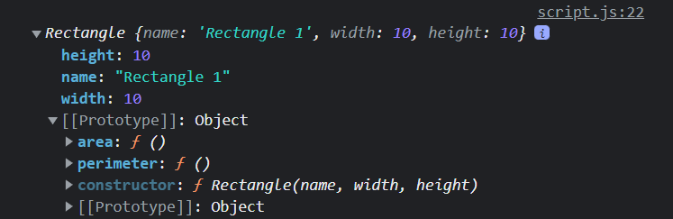

# Adding Methods & Properties to Prototypes

In the previous lesson, we learned about `prototypes`. In this lesson, we will learn how to add methods and properties to `prototypes`.

## Adding Methods to Prototypes

Let's look at the `Rectangle` object we created in the previous lesson.

```js
function Rectangle(name, width, height) {
  this.name = name;
  this.width = width;
  this.height = height;
  this.area = function () {
    return this.width * this.height;
  };
}
```

It's clear that every rectangle will take in a `name`, `width`, and `height`. However, the `area` method is the absolute same for every rectangle. it will always be the `width` x `height`. So instead of keeping the `area()` method on the object itself, we can move it to the `prototype` of the `Rectangle` object.

First, remove the method from the `Rectangle` constructor function.

```js
function Rectangle(name, width, height) {
  this.name = name;
  this.width = width;
  this.height = height;
}
```

Then, add the `area()` method to the `Rectangle.prototype`.

```js
Rectangle.prototype.area = function () {
  return this.width * this.height;
};
```

We still have access to the `area()` method on every rectangle object, but it's now on the `prototype`.

```js
const rect1 = new Rectangle('Rectangle 1', 10, 10);

console.log(rect1.area()); // 100
```

Let's add another method for the `perimeter` of the rectangle.

```js
Rectangle.prototype.perimeter = function () {
  return this.width * 2 + this.height * 2;
};
```

Now, we can access:

```js
console.log(rect1.perimeter()); // 40
```

Let's log the `rect1` object to see what it looks like.

```js
console.log(rect1);
```

As you can see, we now have 2 methods in addition to the `constructor`.



Also, notice that it inherits `Object.prototype`.

## Using arguments

We can also pass in arguments to the `prototype` methods. Let's add a method to change the name. It will take in a `newName` argument.

```js
Rectangle.prototype.changeName = function (newName) {
  this.name = newName;
};

rect1.changeName('Rectangle One');
console.log(rect1); // Rectangle {name: "Rectangle One", width: 10, height: 10, area: ƒ, perimeter: ƒ, …}
```

I'm not going to leave this method, on the `prototype`. I just wanted to show that they can take in arguments.
