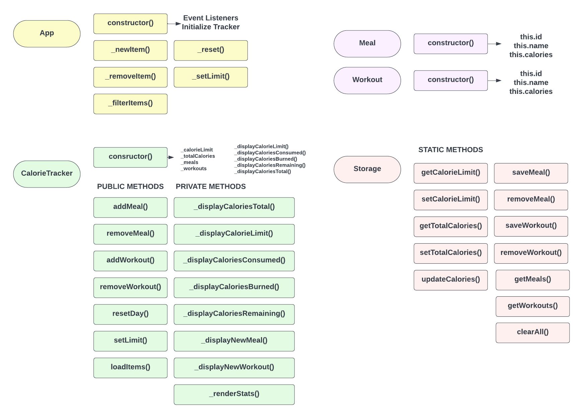

# Project Planning & Diagram

It's always a good idea to take time before starting a project and plan out the steps. This will give you sort of a map and will help you stay on track and make sure you don't miss anything.

The following diagram shows every class, property, method and relationship that will be needed for this project.

## App Class

The `App` class is basically the initializer. This is the only class that we instantiate in the global scope. Everything kicks off from there.

In the constructor, we will instantiate the CalorieTracker class, which is responsible for anything to do with tracking and displaying calorie related data. We will also have all of the event listeners in the constructor of the `App` class.

We will be using the tracker within all of the `App` class methods, so we will store it in a property called `_tracker`.

We are abiding by the underscore convention for private properties and methods that should only be accessed within that class.

## CalorieTracker Class

This is the main class for all of our calorie tracking and displaying. It will hold properties for the total calories, daily limit, meals and workouts. It will also have methods for adding and deleting items as well as displaying calorie data in the DOM.

## Meal & Workout Classes

The `Meal` and `Workout` classes will be very simple. they will only have a constructor with an `id`, `name` and `calories` property. When we use the `addMeal()` or `addWorkout()` methods in the tracker, we will be passing in an object instance of the `Meal` or `Workout` class.

## Storage Class

The `Storage` class will be responsible for storing and retrieving data from `localStorage`. We will store the total calories, calorie limit, meals and workouts. This will let us persist the data even if the user refreshes the page. All of the methods in this class will be static. There is no need to instantiate this class because there is only one `localStorage`.

Hopefully, this gives you an idea of how the project will be structured.
