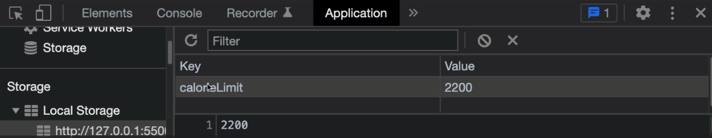

# Storage Class & Calorie Limit Persist

In the last lesson, we added the ability to set the calorie limit. However, if you refresh the page, it will go back to the default of 2000. In this lesson, we will implement localStorage to save the data.

Let's create a `Storage` class:

```js
class Storage {}
```

This class will have all `static` methods. Meaning we do not have to instantiate the class. There is no need to because we never need more than one instance. So we can call the methods directly from the class (Storage.methodName()).

Let's add a method to get the calorie limit from localStorage:

```js

class Storage {
  static getCalorieLimit(defaultLimit = 2000) {
    let calorieLimit;
    if (localStorage.getItem('calorieLimit') === null) {
      calorieLimit = defaultLimit;
    } else {
      calorieLimit = +localStorage.getItem('calorieLimit');
    }
    return calorieLimit;
  }
}

We are first checking if there is a calorieLimit in localStorage. If not, we are setting it to the defaultLimit. If there is, we are parsing it to an integer and returning it.
```

Now, we need a method to set the calorie limit in localStorage:

```js
class Storage {
  static setCalorieLimit(calorieLimit) {
    localStorage.setItem('calorieLimit', calorieLimit);
  }
}
```

Let's change the default limit in the `CalorieTracker` class to use the `Storage` class:

```js
class CalorieTracker {
  constructor() {
    this.calorieLimit = Storage.getCalorieLimit();
}
```

When we set the limit in the `CalorieTracker` class, we need to update the localStorage:

```js
setLimit(calorieLimit) {
    this._calorieLimit = calorieLimit;
    Storage.setCalorieLimit(calorieLimit); // Add this line
    this._displayCalorieLimit();
    this._render();
}
```

Now, when you submit the limit form in the modal, it will update local storage and persist in the app. If you look in the `Application` tab in the devtools, and click on `Local Storage`, you should see the key/value pair.


