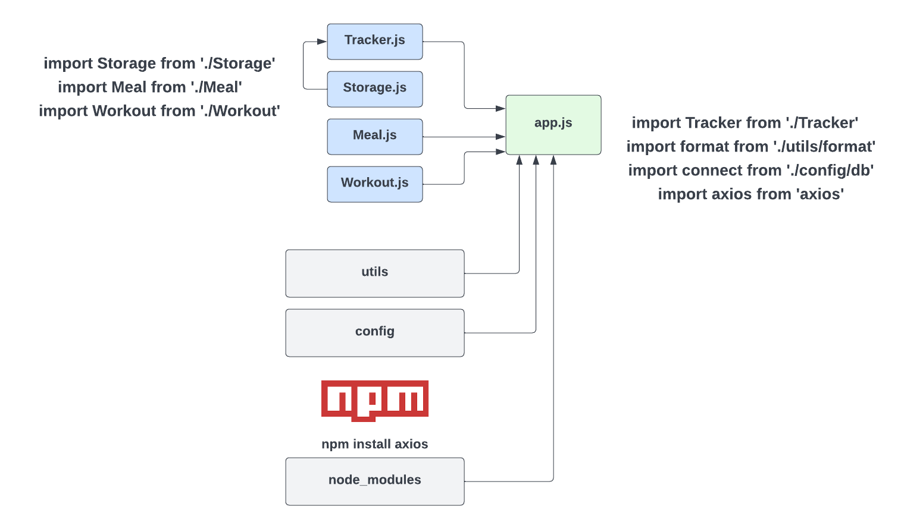

# What Are Modules

So what are modules? Modules are just JavaScript files that we can import into other JavaScript files. We can then use the code that is in the module in the file that we import it into. Now an import is not like a PHP include for instance, where we simply just have everything accessible to us. We need to export what we want from the file. This could be a function, a class or even just a variable value or an object. Modules can be our own files and code or they can be part of a package that we install using `NPM` or the `Node Package Manager`. If you want to use NPM modules in the front-end, you need to use a module bundler like Webpack, which we're going to get into later. For now, let's just focus on how to create our own modules using our own files.

The reason that modules are so important is because they allow us to break our code up into different files. This makes our code more organized and easier to maintain. Using our **Tracalorie** app as an example, we had a single app.js file with 5 different classes. that's not really ideal. Imagine if we had 100 classes. It would be more organized to put each class into it's own module. We can then import the modules into the app.js file. This way, we can keep our code organized and maintainable. Like I said, later on, we'll refactor our Tracalorie app to use modules.

Modules are obviously **modular**, so we can reuse them where we want. You may have a module with some utilitly classes to add commas to a number or something. Where ever you want to use that, you can import it and use it.

Using a module bundler also means that we can use NPM packages. So you have access to over a million 3rd-party modules to enhance your application. You can't use NPM with the way that we've been doing things.

Also, when you use something like Webpack or Parcel, you have access to tools to optimize your project. Whether it's minifying your code or using Sass or a custom dev server, you can create a very customized environment.

## Types Of Modules

There are a few different types of modules when it comes to JavaScript. The two main types are `CommonJS Modules` and `ES Modules` or `ES6 Modules`. `CommonJS Modules` are the modules that are usually used in Node.js. We're going to talk about Node more in the next video. When you use a front-end framework like React, Angular or Vue, you'll be using `ES Modules`. I'm going to show you both types.

ES Modules and CommonJS modules have a different syntax, but the idea is the same. We export what we want from a specific module/file and import it into another. We can export variables, functions, classes, etc.

## Modules & The Browser

When it comes to using modules in the browser, there is support for `ESM` or `ES Modules` in newer browsers, however they're not supported in older browsers. So in order to use them, you will usually use a module bundler like `Webpack` or `Parcel` to bundle our modules into a single file that can be used in the browser. I will show you how to use ES Modules directly in the browser, but it is recommended that you use some kind of module bundler.

## Visual Example

Let's look at an example of what we could do for the Tracalorie project if we broke it up into modules:

We could separate out the tracker, storage, meal and workout classes into their own files. We would export the whole class, that way we could use whatever methods we needed from that class. Since we use the tracker, the meal and the workout class in the main App class, we would import it into app.js. The Storage class is used in the tracker, so we would import that into `Tracker.js`. The syntax we're looking at here is the `ES6 Module` syntax. CommonJS is a bit different. I'm going to show you both.

I added some other files and folders just as an example. We may have a config folder and a utile folder with more code we want to import. We could also install 3rd-party modules/packages using `NPM`. For instance, if we installed the `axios` package, which is an HTTP client, we could import it where we needed it.

In order to teach you about the `CommonJS` modules as well as `NPM` modules, we need to talk about and install Node.js. So we'll do that in the next lesson.
