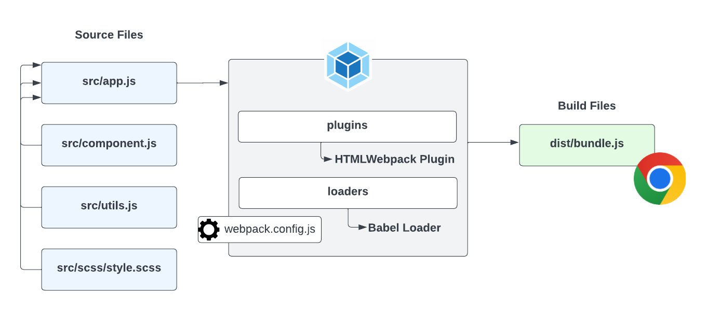

# Webpack Module Bundler

So now that you understand the concept of modules, let's talk about module bundlers. A module bundler is a tool that takes all of your modules and bundles them into one or more files that can be used in the browser. There are a few popular module bundlers out there, but in this video, we'll be focusing on `Webpack`. There are some others such as `Vite`, `Parcel` and `Snowpack`. I'll be honest and say that Webpack is probably the most difficult of the bunch, but it's the one that's been around forever, so you'll probably run into it at some point. Also, if you learn Webpack now, learning the others will be simple.

Webpack is used by a lot of companies. It's very popular and has a lot of features. It's also very flexible and can be configured to do a lot of different things. The next few videos will all have to do with creating a Webpack project from scratch. We'll start with the basics and then add more and more features as we go.

I can almost guarantee that you will be a bit overwhelmed if you've never used a module bundler. It takes some time to get used to them, but the good news is, once you create this boilerplate, you can use it for pretty much any project that you create. So, it's worth it to spend some time learning about it. The code that we write that pertains to the module bundler will only be a small part of your application and is reuseable accross applications.

## How It Works

The way that we've been doing things is pretty simple. We create our JavaScript code and run it in the browser. However, when you get into more advance JavaScript and start building bigger applications, you're probably going to use some kind of build tool such as Webpack. You may get into a framework like React, but this is the same process that goes on under the hood with front-end frameworks.

The way that Webpack and other bundlers work is that they take all of your JavaScript files and bundle them into one or more files that can be used in the browser. This allows you to create all kinds of files and modules, use NPM packages, import CSS files and other assets and much more. As you can see from this diagram. We write our code in the source or `src` folder, then we run it through Webpack which bundles it into one or more files that can be used in the browser.

The files in your `dist` or `build` folder are the files that you would use in production. You would upload those files to your server. The files in your `src` folder are the files that you would use during development. So you need to get used of the idea that you have `development` or `source` files and `production` or `build` files.

There's a few parts of Webpack that I want to mention here and we'll see these in action very soon.

## Webpack Config

First, Webpack is configured using a file called `webpack.config.js`. This file is a JavaScript file that exports an object. The object contains all of the configuration for Webpack. You can specify your input and output files, project mode, as well as any loaders and plugins, which I'll talk about now.

## Loaders

Webpack has something called `loaders`. Loaders are used to process different types of files and convert them into modules that can be used in your application. For instance, if you want to import a CSS file into your JavaScript, you would use a CSS loader. If you want to import an image, you would use an image loader. There are loaders for pretty much anything you can think of. You can even create your own loaders if you want. The Babel loader, which I have as an example here, is commonly used. Babel is a transpiler that will take your modern JavaScript code and transpile it to older JavaScript that older browsers can understand. We'll look at Babel later.

## Plugins

Webpack also has something called plugins. Plugins are used to extend the functionality of Webpack. For instance, if you want to minify your JavaScript, you would use a minification plugin. If you want to extract your CSS into a separate file, you would use a CSS extraction plugin. We'll be using the `HTMLWebpack` plugin to automatically generate our HTML production files and the `WebpackDevServer` plugin to give us a nice auto reload dev server to work with.

Alright, in the next lesson, we're going to create a basic Webpack setup.

