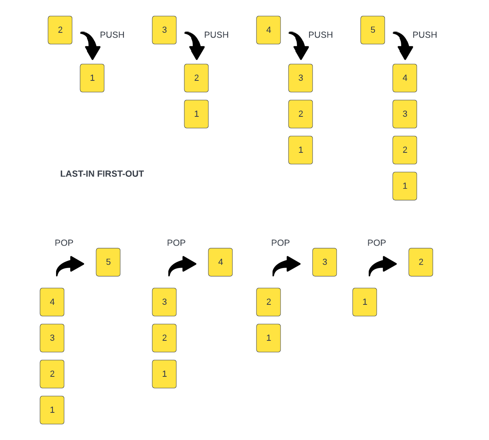

# Stacks

So we have looked at built-in data structures like arrays, objects, sets and maps, but now I want to cover some custom data structures. We'll start with stacks, which if you've been following along, you should already be somewhat familiar with because we talked about the `call stack` earlier in the course.

Stacks are `LIFO` (Last In First Out) data structures. The last item added to the stack will be the first item removed from the stack. We talked about stacks way back when we were looking at the call stack. The call stack is a stack of functions that are called. The last function called is the first function to be removed from the stack.



Since stacks are not built in to JavaScript, we will have to create our own.
We will create a class called `Stack` that will have the following methods:

- `push()`
- `pop()`
- `peek()`
- `length()`
- `isEmpty()`

We will have a constructor where we initialize our data. We will use an array to store our data. We will also have a `count` property that will keep track how many items are in the stack. We will use underscores, because they are all private properties, meaning the should not be accessed outside of the class.

```js
class Stack {
  constructor() {
    this._items = [];
    this._count = 0;
  }
}
```


## `push()`
Now we can add the `push()` method. This method will add an item to the top of the stack. Some people just use the built in `push()` method for arrays, but we are going to do this without any help from pre-defined methods. We will use the count as the index and set the item. Then increment the count by 1,

```js
  push(item) {
    this._items[this._count] = item;
    this._count++;
  }
```

## `pop()`

Now we can add the `pop()` method. This method will remove an item from the top of the stack. Again, we could take the easy way out and use the `Array.prototype.pop()` method, but we want this to be barebones.

First, we check to see if the stack is empty and return "Underflow" if it is. That;s what it's called when you try and pop off an item that is not there. It's the opposite of a stack overflow.

Then we store the last item of the stack into a variable 'item'. This item is going to be returned at the end of the method.

It decrements the count property by 1, to reflect that the stack now has one less item.

It starts a for loop, where the variable `i` is initialized to the value of the count, and the loop continues as long as `i` is less than the length of the items array.

Inside the for loop, the method assigns the value of this.items[i+1] to this.items[i]. This has the effect of shifting all items in the array to the left by one index. This way it removes the last item of the array by shifting all the items to the left by one index.

The variable i is incremented by one on each iteration, so the loop can continue processing the next item of the array.

The loop continues until all the items have been shifted to the left.

Finally, the method updates the length property of the items array to the value of the count property. This reduces the length of the array, effectively removing the last item.

The last step is returning the variable 'item' that was stored in the first step. This variable holds the value of the last item of the stack before poping it out.

```js
pop() {
   if (this._count === 0) {
      return 'Underflow';
    }
    const item = this._items[this._count - 1];
    this.count--;
    for (let i = this._count; i < this._items.length; i++) {
      this._items[i] = this._items[i + 1];
    }
    this._items.length = this._count;
    return item;
  }
```

## `isEmpty()`

We will need to check if the count is === 0 a couple times, so let's create an `isEmpty()` method

```js
isEmpty() {
  return this._count === 0;
}
```

Add the `isEmpty()` to the `pop()` method

```js
 if (this.isEmpty()) {
  return 'Underflow';
}
```

Now we can add the `peek()` method. This method will return the item at the top of the stack. We will return the item from the `data` array with an indec that is 1 less than the count.

## `peek()`

```js
  peek() {
    if (this.isEmpty()) {
      return 'No items in Stack';
    }
    return this._items[this._count - 1];
  }
```

## `length()`

Now we can add the `length()` method. This method will return the length of the stack. We will return the `count` property.

```js
length() {
  return this._count;
}
```

## `clear()`

This will clear all items and set the count to 0

```js
  clear() {
    this._items = [];
    this._count = 0;
  }
```


Now we can create a new instance of the `Stack` class and add some items to it.

```js
const stack = new Stack();
```

At the bottom of the script, let's check the length, top item and if empty

```js
console.log('Top item: ', stack.peek());
console.log('Stack Length: ', stack.length());
console.log(stack.isEmpty() ? 'Stack is empty' : 'Stack is not empty');
```

Let's add some items

```js
stack.push('First Item');
stack.push('Second Item');
```

We should see a length of `2` and a top item of `Second Item`

Let's add a couple more items. We will add some strings

```js
stack.push('Third Item');
stack.push('Fourth Item');
```

Now we should see a length of `4` and a top item of `Fourth Item`

Let's remove an item

```js
stack.pop();
```

We should see a length of `3` and a top item of `Third Item`

Let's remove a couple more items

```js
stack.pop();
stack.pop();
```

You should be able to call `stack.clear()` at any time and it will clear all items.

We should see a length of `1` and a top item of `First Item`

So we have created a stack class that we can use in our applications. We can use this class to create a stack of any type of data.
