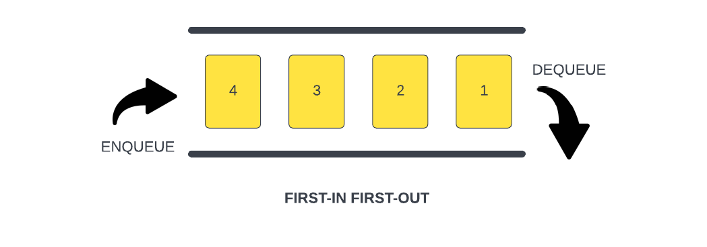

# Queues

Queues are another type of data structure specifically designed to operate in a FIFO context (first-in first-out), where items are inserted into one end of the container and extracted from the other.



We saw an example of this when we looked at the JavaScript `Task Queue`. The `Task Queue` is a queue of functions that are waiting to be executed. The first function in the queue is the first function to be executed.

Let's create a class called `Queue` that will have the following methods:

- `enqueue()`
- `dequeue()`
- `peek()`
- `length()`
- `isEmpty()`

We will have a constructor where we initialize our data. We will use an array to store our data. We will also have a `count` and a `front` property that will keep track of the front of the queue. We will use udnescores to signify that these are private properties.

```js
class Queue {
  constructor() {
    this._items = [];
    this._count = 0;
    this._front = 0;
  }
}
```

## `enqueue()`

Now we can add the `enqueue()` method. It takes in a single parameter, item, which is the item that is being added to the queue.

It assigns the value of the item parameter to the next empty index of the `items` array. The next empty index is determined by the current value of the `count` property. Then it increments the `count` property by 1 to reflect that the queue now has one more item.

```js
 enqueue(item) {
    this._items[this._count] = item;
    this._count++;
  }
```

## `dequeue()`

Now we can add the `dequeue()` method. This method will remove an item from the front of the queue. We first check to see if there is anythin in the queue.

It stores the first element of the queue into a variable 'item'. This element is going to be returned at the end of the method.

It starts a for loop, where `i` is initialized to the value of the `first` property, and the loop continues as long as `i` is less than the `count` property - 1.

Inside the for loop, the method assigns the value of `this._items[i+1]` to `this._items[i]`. This way it removes the first element of the array by shifting all the elements to the left by one index.

Then `i` is incremented by one on each iteration, so the loop can continue processing the next element of the array.

Finally, the method decrements the `count` property by 1 to reflect that the queue now has one less item, and updates the length property of the `items` array to the value of the `count` property. This reduces the length of the array, effectively removing the first element.

```js
dequeue() {
    if (this._count === 0) {
      return 'Underflow';
    }
    const item = this._items[this._front];
    for (let i = this._front; i < this._count - 1; i++) {
      this._items[i] = this._items[i + 1];
    }
    this._count--;
    this._items.length = this._count;
    return item;
  }
```

## `isEmpty()`

Let's add a method to check to see if the queue is empty

```js
isEmpty() {
    return this.length() === 0;
  }
```

You can then add that to the `dequeue()` method

```js
if (this.isEmpty()) {
      return 'Underflow';
    }
```

## `peek()`
Now we can add the `peek()` method. This method will return the item at the front of the queue. We will return the item from the `data` array at the `front` property.

```js
 peek() {
    if (this.isEmpty()) {
      return 'No items in Queue';
    }
    return this._items[this._front];
  }
```

## `length()`

Now we can add the `length()` method. This method will return the length of the queue. We will return the `back` property minus the `front` property.

```js
length() {
  return this.back - this.front;
}
```


Now we can create a new instance of the `Queue`

```js
const queue = new Queue();
```

Lets show the front item, lenth and if empty

```js
console.log('Front Item: ', queue.peek());
console.log('Queue Length: ', queue.length());
console.log(queue.isEmpty() ? 'Queue is empty' : 'Queue is not empty');
```

Above that, go ahead and add a couple items

```js
queue.enqueue('First item');
queue.enqueue('Second item');
queue.enqueue('Third item');
```

You should see the first item as the front

Let's remove an item

```js
queue.dequeue();
```

Now you should see the second item as the front

So you can see that the `Queue` class is working as expected, which is first in first out.
