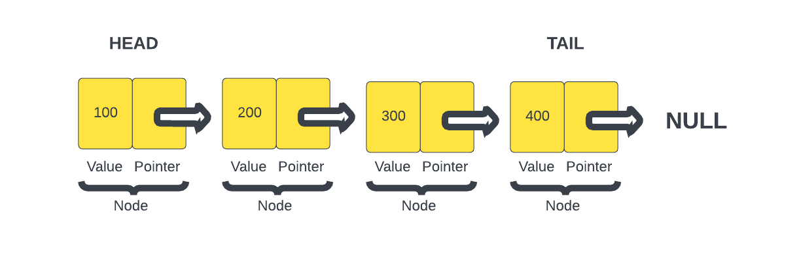

# Linked Lists

A linked list is a data structure that contains a sequence of nodes. They are similar to arrays, but the difference is that elements are not stored in a particular memory location or index. Rather, each element is a separate object that contains a pointer or a link to the next object in that list.

Linked Lists are a common interview question. You probably won't use them in your day to day work, but learning this stuff helps your overall understanding of data structures and programming in general.

Let's look at a diagram to help you visualize a linked list.



As you can see a linked list is made up of `nodes`. Each node contains a `value` and a `pointer` to the next node. The first node is called the `head` and the last node is called the `tail`. The `tail` node will point to `null` since there is nothing after it.

Before, we crate our class, I'll just use object literals to represent our nodes.

```js
const node1 = {
  value: 100,
};

const node2 = {
  value: 200,
};
```

Here we just have two nodes. We can connect them by setting the `next` property on `node1` to be `node2`.

```js
node1.next = node2;
```

Now we have a linked list with two nodes. We can add more nodes by setting the `next` property on `node2` to be another node.

```js
const node3 = {
  value: 300,
};

node2.next = node3;
```

That is a very simplistic example of a linked list.

Now, we will create 2 classes, a `Node` class and a `LinkedList` class. The `Node` class will represent a node in the linked list. It will have a `value` property and a `next` property. The `next` property will point to the next node in the list.

```js
class Node {
  constructor(value) {
    this.value = value;
    this.next = null;
  }
}
```

We can initialize a node with:

```js
const node1 = new Node(100);
console.log(node1); // Node { value: 100, next: null }
```

Don't leave this in your code, it is just to show you how we will be initializing nodes within the `LinkedList` class.

Let's create a class called `LinkedList` that will have the following methods:

- `insertFirst()`
- `insertLast()`
- `insertAt()`
- `getAt()`
- `removeAt()`
- `printListData()`
- `clearListData()`

We will have a constructor where we initialize our data. We will use a `head` property to keep track of the first node in the list and a `tail` property to keep track of the last node in the list. I am also going to add some comments for the methods that we will be creating.

```js
class LinkedList {
  constructor(value) {
    this.head = null;
    this.length = 0;
  }

  // Insert first node (head)

  // Insert last node (tail)

  // Insert at index

  // Get at index

  // Remove at index

  // Print the list data

  // Clear list data
}
```

## `insertfirst()`

We pass in the data for this node. Then we initialize a new node using the `Node` class. We set the `next` property on the new node to be the `head` property. Then we set the `head` property to be the new node. Finally, we increment the `length` property by `1`.

```js
  // Insert first node (head)
  insertFirst(data) {
    const newNode = new Node(data);
    newNode.next = this.head;
    this.head = newNode;
    this.length++;
  }
```

We can test this method by creating a new instance of the `LinkedList` class and calling the `insertFirst()` method.

```js
const list = new LinkedList();
list.insertFirst(100);
console.log(list); // LinkedList { head: Node { value: 100, next: null }, length: 1 }
```

The `head` property is now pointing to the new node, which has a `value` of 100 and a `next` value pointing to `null` because it is the only node in the list. The `length` property is now `1`.

If we add another node with...

```js
list.insertFirst(200);
console.log(list); // LinkedList { head: Node { value: 200, next: Node { value: 100, next: null } }, length: 2 }
```

That node with the value of `200` is now the `head` of the list. The `next` property on that node is pointing to the node with the value of `100`. The `length` property is now `2`.

## `insertLast()`

Now we want to be able to add a node to the end of the list. We will create a method called `insertLast()`.

```js
  // Insert last node (tail)
  insertLast(data) {
    const newNode = new Node(data);
    let current = this.head;
    while (current.next) {
      current = current.next;
    }
    current.next = newNode;
    this.length++;
  }
```

We create a new node with the data that is passed in. Then we create a variable called `current` and set it to the `head` property. We use a `while` loop to loop through the list until we get to the `tail` node. The `tail` node will have a `next` property of `null`. We set the `next` property on the `tail` node to be the new node. Finally, we increment the `length` property by `1`.

We can test this method by creating a new instance of the `LinkedList` class and calling the `insertLast()` method.

```js
const list = new LinkedList();
list.insertFirst(100);
list.insertFirst(200);
list.insertFirst(300);
list.insertLast(400);
console.log(list);
```

Now the `tail` node has a `value` of `400` and a `next` property of `null`. The `length` property is now `4`.

## `printListData()`

Let's jump down to the `printListData()` method. This will help us see the data in the list.

```js
  // Print the list data
  printListData() {
    let current = this.head;
    let list = '';
    while (current) {
      list += current.value + ' ';
      current = current.next;
    }
    console.log(list);
  }
```

We create a variable called `current` and set it to the `head` property. We create a variable called `list` and set it to an empty string. We use a `while` loop to loop through the list. We add the `value` property of the current node to the `list` variable. We then set the `current` variable to be the `next` property on the current node. We log the `list` variable to the console.

We can test this method by creating a new instance of the `LinkedList` class and calling the `printListData()` method.

```js
const list = new LinkedList();
list.insertFirst(100);
list.insertFirst(200);
list.insertFirst(300);
list.insertLast(400);
list.printListData(); // 300 200 100 400
```

## `insertAt()`

Now we want to be able to insert a node at a specific index. We will create a method called `insertAt()`.

```js
  // Insert at index
  insertAt(data, index) {
    if (index > 0 && index > this.length) {
      return;
    }

    if (index === 0) {
      this.insertFirst(data);
      return;
    }

    const newNode = new Node(data);
    let current, previous;
    current = this.head;
    let count = 0;

    while (count < index) {
      previous = current;
      count++;
      current = current.next;
    }

    newNode.next = current;
    previous.next = newNode;
    this.length++;
  }
```

We check if the index is greater than 0 and greater than the length of the list. If it is, we return. If the index is `0`, we call the `insertFirst()` method. We create a new node with the data that is passed in. Then we create a variable called `current` and set it to the `head` property. We create a variable called `previous` and set it to `null`. We create a variable called `count` and set it to `0`. We use a `while` loop to loop through the list until we get to the index that we want to insert the node at. We set the `previous` variable to be the `current` variable. We increment the `count` variable by `1`. We set the `current` variable to be the `next` property on the `current` variable. We set the `next` property on the `newNode` to be the `current` variable. We set the `next` property on the `previous` variable to be the `newNode` variable. Finally, we increment the `length` property by `1`.

We can test this method by creating a new instance of the `LinkedList` class and calling the `insertAt()` method.

```js
const list = new LinkedList();
list.insertFirst(100);
list.insertFirst(200);
list.insertFirst(300);
list.insertLast(400);
list.insertAt(500, 2);
list.printListData(); // 300 200 500 100 400
```

## `getAt()`

Now we want to be able to get a node at a specific index. We will create a method called `getAt()`.

```js
  // Get at index
  getAt(index) {
    let current = this.head;
    let count = 0;
    while (current) {
      if (count == index) {
        console.log(current.value);
      }
      count++;
      current = current.next;
    }
    return null;
  }
```

We create a variable called `current` and set it to the `head` property. We create a variable called `count` and set it to `0`. We use a `while` loop to loop through the list. We check if the `count` variable is equal to the index that we want to get. If it is, we log the `value` property of the current node to the console. We increment the `count` variable by `1`. We set the `current` variable to be the `next` property on the `current` variable. We return `null` if the index is not found.

We can test this method by creating a new instance of the `LinkedList` class and calling the `getAt()` method.

```js
const list = new LinkedList();
list.insertFirst(100);
list.insertFirst(200);
list.insertFirst(300);
list.insertLast(400);
list.insertAt(500, 2);
list.getAt(2); // 500
list.getAt(3); // 100
```

## `removeAt()`

Now we want to be able to remove a node at a specific index. We will create a method called `removeAt()`.

```js
  // Remove at index
  removeAt(index) {
    if (index > 0 && index > this.length) {
      return;
    }

    let current = this.head;
    let previous;
    let count = 0;

    if (index === 0) {
      this.head = current.next;
    } else {
      while (count < index) {
        count++;
        previous = current;
        current = current.next;
      }
      previous.next = current.next;
    }
    this.length--;
  }
```

We check if the index is greater than 0 and greater than the length of the list. If it is, we return. We create a variable called `current` and set it to the `head` property. We create a variable called `previous` and set it to `null`. We create a variable called `count` and set it to `0`. If the index is `0`, we set the `head` property to be the `next` property on the `current` variable. Otherwise, we use a `while` loop to loop through the list until we get to the index that we want to remove the node at. We increment the `count` variable by `1`. We set the `previous` variable to be the `current` variable. We set the `current` variable to be the `next` property on the `current` variable. We set the `next` property on the `previous` variable to be the `next` property on the `current` variable. Finally, we decrement the `length` property by `1`.

We can test this method by creating a new instance of the `LinkedList` class and calling the `removeAt()` method.

```js
const list = new LinkedList();
list.insertFirst(100);
list.insertFirst(200);
list.insertFirst(300);
list.insertLast(400);
list.insertAt(500, 2);
list.printListData(); // 300 200 500 100 400
list.removeAt(2);
list.printListData(); // 300 200 100 400
```

As you can see, the value of `500` was removed from the list.

## `clearList()`

Now we want to be able to clear the list. We will create a method called `clearList()`.

```js
  // Clear list
  clearList() {
    this.head = null;
    this.length = 0;
  }
```

We set the `head` property to `null` and set the `length` property to `0`.

We can test this method by creating a new instance of the `LinkedList` class and calling the `clearList()` method.

```js
const list = new LinkedList();
list.insertFirst(100);
list.insertFirst(200);
list.insertFirst(300);
list.insertLast(400);
list.insertAt(500, 2);
list.printListData(); // 300 200 500 100 400
list.clearList();
list.printListData(); // ""
```

That's it, we have now created a linked list data structure in JavaScript.
