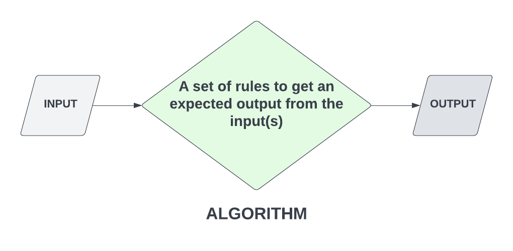

# What Are Algorithms? / Section Intro

We looked at some data-structures, which really help you become a better programmer and are also very popular in software development job interviews. Algorithms are another side of the same coin. In fact, you hear the term "data structures and algorithms" a lot. In this section, we'll be not only solving some algorithms, but we'll be writing unit-tests to run to see if we did them correctly. I'll talk more about testing in the next lesson. Let's look at what an algorithm actually is.

Algorithms are used in computer programming to solve problems. They are also used in mathematics, science, engineering, and many other fields.

I like to keep things as simple as possible, so a simple explanation is that an algorithm is a set of instructions for accomplishing a task. Usually, you have an input or a set of inputs that you run through an algorithm to get an expected output. People like to think algorithms have to be this crazy braniac type thing that only tech geniuses can solve, but the truth is, an algorith can be as simple as a `getSum(n1, n2)` function. You're passing in input, in the form of function arguments, which are the 2 numbers to be added and you have an expected output. You can also write tests to validate that algorithm. In fact, that will the first test we write.

We did the FizzBuzz challenge a while ago when we were learnig about loops. That's actually a very popular algorithm for job interviews.

This section is going to have challenges that you can either stop and try yourself or just follow along to see the solution. I would encourage you to try them yourself. Im almost hesitant to say that because solving algorithms is a skill that takes time to develop. It's not something that you can just pick up and do. There are many of you that won't be able to do any of these on your own. Just know that that is absolutely fine.

For those of you that do want to try them on your own, keep in mind that you can search for the methods and functions that you need to solve the problem.

These problems will rnge from easy to intermediate. We're not really doing anything advanced because that's just not what this course is.

IN the next lession, we'll talk a little bit more about testing.
