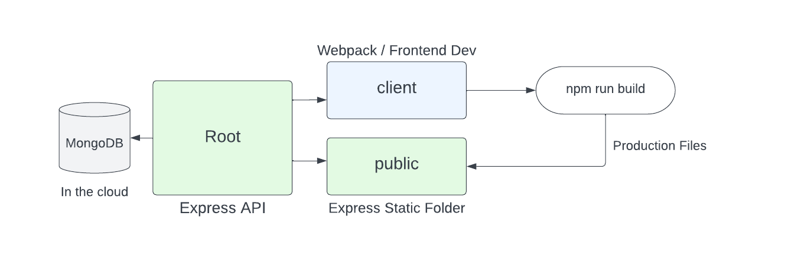

# Fullstack Workflow

Now that we have our API done, we are going to start working on the front end. Before we jump into the code, I just want to go over the structure and the workflow of our project.

Here is a diagram of the structure of our project:

We already created the backend, which consists of the root folder with our Express API as well as the MongoDB database.

Now, will create a `client` folder. This will be our frontend development folder. We will use the `webpack-starter` as a base for our frontend.

We will configure Webpack to build our production files into a `public` folder in the root. This will be the folder that we will serve our static files from. With Express, we can serve static files from any folder. We will use this folder to serve our production `index.html` file as well as our bundled JavaScript and CSS files.

Let's start setting up the `client` folder in the next lesson.
